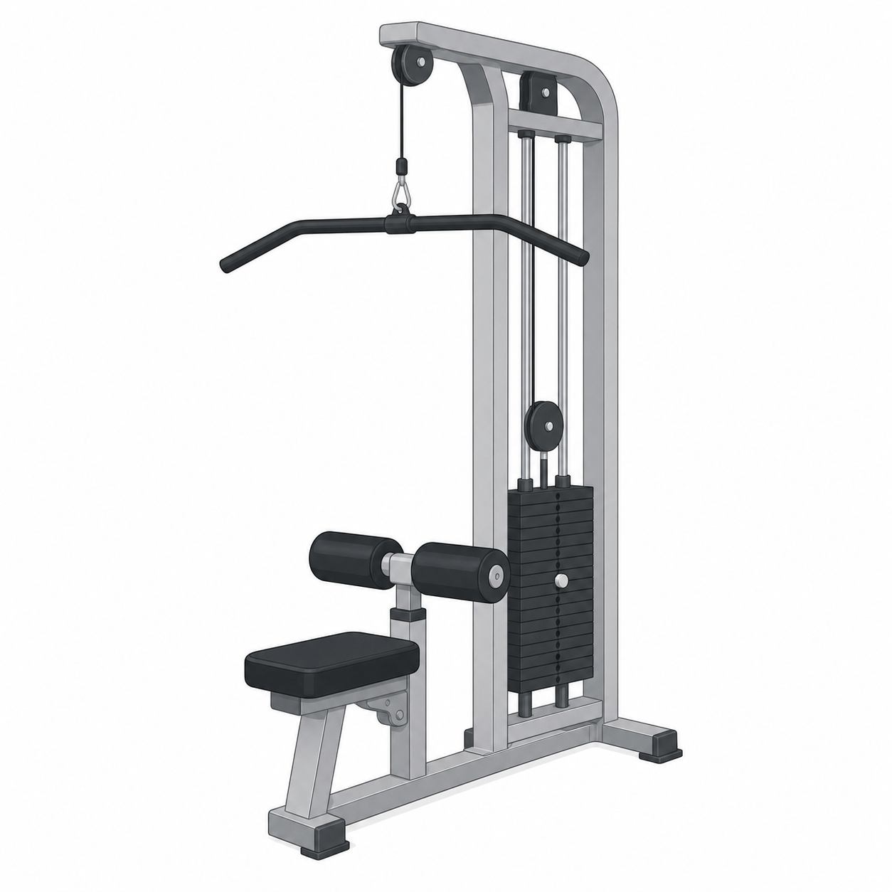
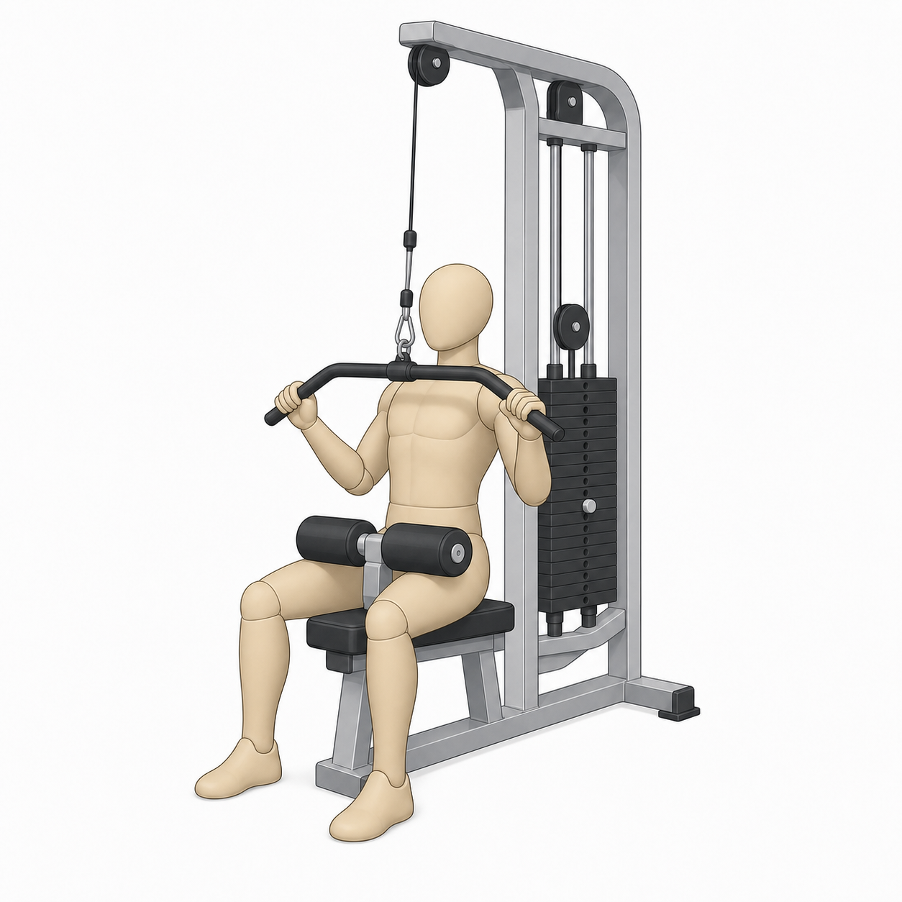

# Lat Pulldown

> Disclaimer: GymPrimer is educational content for general exercise literacy.
> It is not medical advice and not personalized coaching.

## What this exercise is for

The lat pulldown is a machine pulling exercise. It helps beginners practice
pulling from overhead toward the front of the body while staying seated and
supported.

Five beginner use cases:

- Learn an overhead pulling pattern before trying less-supported variations.
- Practice keeping the torso steady while the arms move.
- Build confidence using an adjustable weight-stack machine.
- Pair with a pushing exercise such as the chest press for a simple upper-body
  session.
- Use a lighter load to practice controlled repetitions before adding weight.

## Equipment setup

Adjust the thigh pad so your legs are held down without feeling pinned. Choose
a light load you can move without swinging. Sit tall, hold the bar with both
hands, and let your arms reach up under control.

Use the image only to recognize the main parts of the machine. The exact shape
of equipment can vary by gym.

## Muscles involved

You should mostly notice work through the sides of the upper back and the front
of the upper arms. Treat this as a practical feel cue, not a body-map test.

## Movement breakdown

Use the image as a simple front-pulldown example. Keep following the written
setup and safety notes, because the picture cannot show the right load or
whether your machine is adjusted for you.

### 1. Set up

Sit tall with your feet on the floor and your thighs under the pad.

### 2. Pull

Pull the bar toward the upper chest. Bring your elbows down beside your ribs.

### 3. Pause

Pause briefly when the bar reaches a comfortable low point.

### 4. Return

Let the bar rise slowly until your arms are long again. Keep the return
controlled instead of letting the weight pull you up.
[Mayo Clinic][mayo-weight-training]

## What you should feel

You should feel effort in your upper back and arms while your torso stays
steady. If you mainly feel momentum, reduce the load and slow the repetition.

## Common mistakes

- Leaning far back to start the pull.
- Pulling the bar behind the neck.
- Letting the weight stack slam at the top.
- Using a load that makes the first repetition messy.

Avoided variation: treat behind-the-neck pulldown as something not to copy in
this beginner primer. Keep the bar path in front of the body toward the upper
chest instead. [Mayo Clinic][mayo-weight-training]

## Easier version

Use a lighter load and pause between repetitions so each pull starts from a
stable seated position.

## Harder version

Use the same setup and add a slightly slower return before increasing the load.

## Safety notes

Stop if sharp or unsafe. [Mayo Clinic][mayo-weight-training]

## Sources

- [Mayo Clinic weight training technique guidance][mayo-weight-training]

[mayo-weight-training]: https://www.mayoclinic.org/healthy-lifestyle/fitness/in-depth/weight-training/art-20045842
