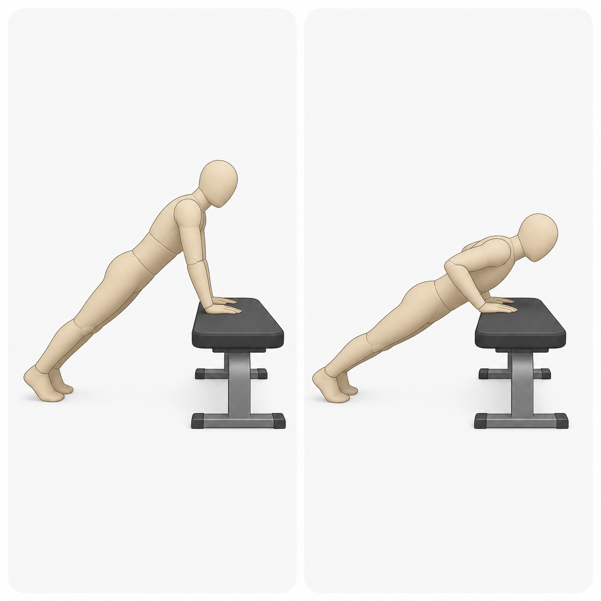

# Contributing

Thanks for contributing.

GymPrimer is a Markdown-first, citation-based exercise, movement, and training-literacy primer for a general audience. The repository Markdown files are the product source of truth; generated output and old structured-platform artifacts are not active v0.1 guidance.

## Pull requests

- Keep changes focused and reviewable.
- Explain why the change is needed.
- Include tests, structural checks, or bounded validation evidence when behavior, content contracts, or safety wording changes.
- Run relevant checks and mention the commands in the pull request.
- Do not describe draft pages as published, approved, expert-reviewed, or active source content before the reviewed milestone promotes them.

## Content scope

GymPrimer accepts static education for common exercises, low-risk bodyweight progressions, simple dumbbell patterns, basic cardio equipment, advanced technique literacy, common patterns, well-studied conditions, programming principles, and generic program examples when the governing artifacts approve the scope.

Do not add specialized competition programming, personalized plans, injury-specific advice, posture-correction protocols, pain treatment, diagnosis, or recovery pathways unless a higher-ranked accepted direction explicitly changes that scope.

Responsible Breadth pages add static consumer education for accepted patterns,
conditions, programming principles, and program examples. Pattern, condition,
and program-example changes require higher-bar review: source traceability,
calm safety routing, non-diagnostic language, no individualized treatment, no
personalized programming, and explicit scope-boundary fit. The higher bar means
no personalized programming. Do not submit
symptom checkers, diagnosis flows, treatment plans, rehab progressions,
injury-specific substitutions, or user-adaptive programs.

## Safety and citations

Original v0.1 exercise pages use a prominent disclaimer stating that GymPrimer
is educational content, not medical advice and not personalized coaching.
Responsible Breadth pages use required scope notes, calm safety routing, and the
project-level disclaimer instead of repeating a full disclaimer block on every
page.

Safety warnings require claim-level citations to public, named sources. A global source in `SOURCES.md` is not enough for a safety claim; readers must be able to verify the claim from the page they are reading.

Use page-local `Sources` sections and reference-style links for v0.1 citations. Add reused sources to `SOURCES.md` when the same source supports more than one page.

## Media

Images are optional. Use them only when they materially help a reader identify
equipment, understand a key movement position, or learn a distinct concept that
Markdown alone does not explain well.

Preferred order:

1. No image when the page is clear without one.
2. Original SVG diagram under `media/`.
3. AI-generated raster illustration under `media/` with an approved row in
   `media/PROVENANCE.md`.

Do not submit undocumented third-party media, stock photos, borrowed public web
images, screenshots of commercial gym machines, decorative images, medical
illustrations, rehab illustrations, identifying people, or local private file
paths.

Every media reference must use a relative repository path and include alt text or nearby explanatory text.

### Image examples

Equipment identification example:

This kind of image helps a reader recognize the machine. It should not
replace setup instructions, safety notes, or sources.

Key movement illustration example:

This kind of image can show important movement positions. It should not add
advanced coaching, diagnosis, rehab guidance, or safety claims that are absent
from the Markdown page.

## Privacy

Do not include secrets, credentials, private contact details, local machine paths, private health information, real user health profiles, or identifying beginner read-test notes.

## License and contribution terms

By submitting a pull request, you agree that:

- code and tooling contributions are provided under Apache-2.0;
- written content, templates, original diagrams, and educational materials are provided under CC BY 4.0;
- you have the right to submit the contributed material;
- you are not submitting copyrighted third-party media unless its license is documented and compatible with the project;
- source wording, citations, and safety language may be edited by maintainers to keep the Markdown-first contract consistent.

## Issues

Use issues for bug reports, feature requests, and project questions. Include enough context for maintainers to reproduce or evaluate the request.
