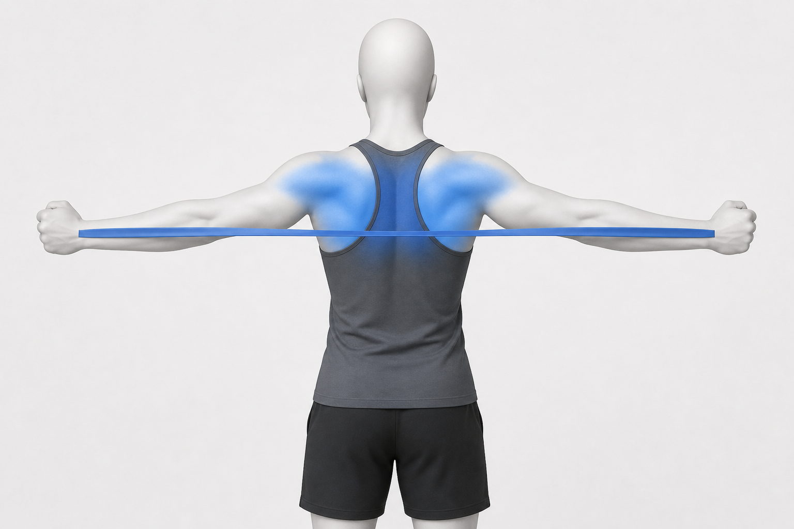
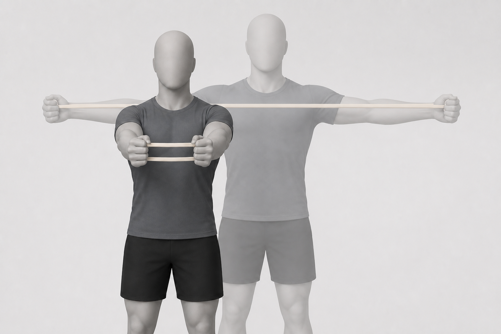

# Band Pull-Apart

Also known as: resistance-band pull-apart

Author: xiongxianfei
Created: 2026-06-30
Last reviewed: 2026-06-30
Next review due: 2027-06-30
Review scope: sources, scope boundary, exercise contract

Safety routing: see [RED-FLAGS.md](../RED-FLAGS.md) for symptoms or professional-care situations where a static exercise page is the wrong tool.

## What this exercise is for

The band pull-apart is a light upper-back and shoulder-blade exercise. It helps beginners practice pulling the hands apart while keeping the neck and ribs quiet. A study of band pull-apart variations supports treating this as a defined elastic-band shoulder exercise, while this page keeps it general and non-prescriptive. [Source][local-band-pull-apart-study]

## Equipment setup

Use a light resistance band. Stand tall with the arms extended in front at chest height and a bit of slack in the band. [Source][local-band-pull-apart-instruction]

## Muscles involved

| Role | Muscle region | What it helps do |
|---|---|---|
| Main driver | Upper back and rear shoulders | Help pull the band apart while the arms open to the sides. [Source][local-band-pull-apart-study] |
| Support | Shoulder-girdle and arms | Help keep the band path near chest height. [Source][local-band-pull-apart-instruction] |
| Posture / control | Neck, ribs, and trunk | Help keep the movement from turning into shoulder shrugging or rib flaring. [Source][local-band-pull-apart-instruction] |

Use the image as a broad attention-region reference. Keep the muscle wording and citations in the Markdown text above.

## Movement breakdown

Use the image as a simple movement reference. Keep following the written setup and safety notes.

### 1. Set up

Stand tall with the band held in both hands at chest height. [Source][local-band-pull-apart-instruction]

### 2. Move

Keep the arms straight as you open them out to the sides. Keep the arms at chest height. [Source][local-band-pull-apart-instruction]

### 3. Pause

Pause briefly while the neck stays relaxed and the ribs stay quiet.

### 4. Return

Let the band come back under control. [Source][local-band-pull-apart-instruction]

## What you should feel

You may feel the upper-back and rear-shoulder region working, with a light stretch across the chest. Try to keep the neck relaxed, ribs quiet, and arms near chest height. [Source][local-band-pull-apart-instruction]

## Common mistakes

- Letting the shoulders lift toward the ears. [Source][local-band-pull-apart-instruction]
- Dropping the arms below chest height during the pull. [Source][local-band-pull-apart-instruction]

## Easier version

Use a lighter band, hold the band wider, or shorten the range.

## Harder version

Use the same band with a slower return before choosing a stronger band. Keep the exercise as one option, not a prescribed routine. [ACSM][acsm-resistance-training]

## Safety notes

Stop for sharp, worsening, unusual, or unsafe symptoms. A static exercise page cannot decide whether symptoms are safe to train through, so use the red-flags reference and professional care when needed. [NHS][nhs-neck-pain]

## Sources

- [ACSM - Resistance training guidance][acsm-resistance-training]
- [Band Pull-Apart Exercise: Effects of Movement Direction and Hand Position on Shoulder Muscle Activity][local-band-pull-apart-study]
- [Hinge Health - Band pull aparts][local-band-pull-apart-instruction]
- [AAOS - Shoulder impingement and rotator cuff tendinitis][aaos-shoulder-impingement-rotator-cuff-tendinitis]
- [Mayo Clinic - Weight training technique guidance][mayo-weight-training]
- [NHS - Neck pain and stiff neck][nhs-neck-pain]

[acsm-resistance-training]: https://acsm.org/resistance-training-guidelines-update-2026/
[local-band-pull-apart-study]: https://pmc.ncbi.nlm.nih.gov/articles/PMC8975561/
[local-band-pull-apart-instruction]: https://www.hingehealth.com/resources/articles/band-pull-aparts/
[aaos-shoulder-impingement-rotator-cuff-tendinitis]: https://orthoinfo.aaos.org/en/diseases--conditions/shoulder-impingementrotator-cuff-tendinitis/
[mayo-weight-training]: https://www.mayoclinic.org/healthy-lifestyle/fitness/in-depth/weight-training/art-20045842
[nhs-neck-pain]: https://www.nhs.uk/conditions/neck-pain-and-stiff-neck/
