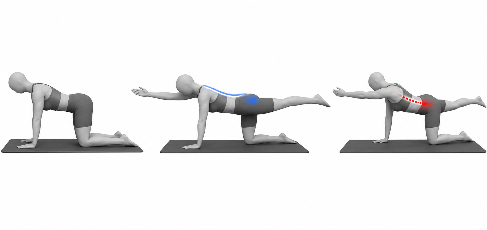

# Bird Dog

Author: xiongxianfei
Created: 2026-06-29
Last reviewed: 2026-06-29
Next review due: 2026-09-27
Review scope: sources, scope boundary, comprehension

## Purpose

Bird dog is a beginner coordination exercise. It trains the reader to keep the trunk steady while one hip extends and the opposite shoulder flexes. That makes it a useful bridge between floor-based trunk control and standing hip-hinge patterns. [NASM][local-bird-dog-nasm-apt] [Physiopedia][local-bird-dog-physiopedia-apt]

## Used muscles

Primary: gluteus maximus, trunk stabilizers, and shoulder stabilizers. Secondary: hamstrings, lumbar extensors, and upper-back muscles.

## Equipment and setup

Use the floor or a firm exercise mat. Start on hands and knees with hands under shoulders and knees under hips.

## Movement phases

1. Set the ribs and pelvis in a quiet middle position.
2. Reach one leg back and the opposite arm forward.
3. Pause without rotating the pelvis.
4. Return slowly and switch sides.

## Important notes

Move slowly enough that the pelvis stays level. A shorter reach is better than twisting or dropping the hip. General strength-exercise guidance applies: use controlled repetitions and stop for sharp, worsening, unusual, or unsafe symptoms. [Mayo Clinic][mayo-weight-training]

## Example pictures

The image above shows the start position, controlled opposite-arm/opposite-leg reach, and a common mistake where the pelvis rotates.

## Patterns and conditions where this exercise appears

- [Anterior Pelvic Tilt](../patterns/anterior-pelvic-tilt.md)

## Sources

- [Mayo Clinic - Weight training technique guidance][mayo-weight-training]
- [NASM - Anterior pelvic tilt overview][local-bird-dog-nasm-apt]
- [Physiopedia - Anterior pelvic tilt][local-bird-dog-physiopedia-apt]

[mayo-weight-training]: https://www.mayoclinic.org/healthy-lifestyle/fitness/in-depth/weight-training/art-20045842
[local-bird-dog-nasm-apt]: https://blog.nasm.org/what-is-anterior-pelvic-tilt-and-how-do-you-fix-it
[local-bird-dog-physiopedia-apt]: https://www.physio-pedia.com/Anterior_Pelvic_Tilt

## Author and review date

xiongxianfei, engineer who reads, not a clinician, 2026-06-29
