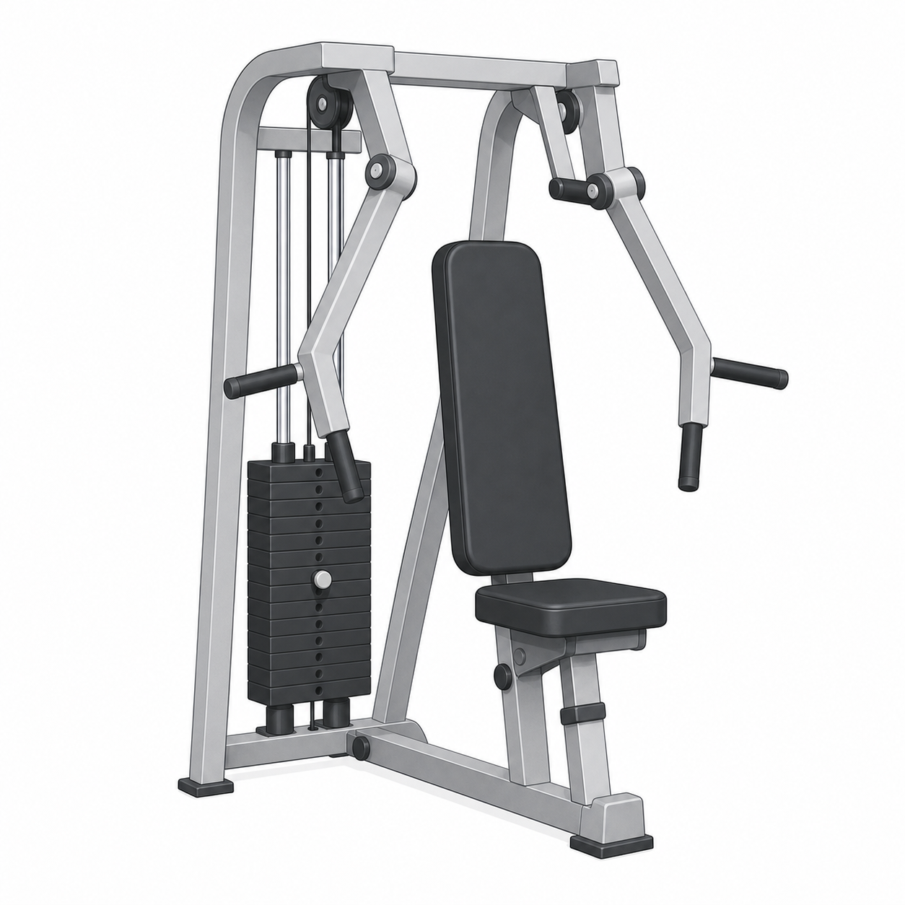

# Chest Press

Author: xiongxianfei
Created: 2026-06-30
Last reviewed: 2026-06-30
Next review due: 2027-06-30
Review scope: sources, scope boundary, comprehension

> Disclaimer: GymPrimer is educational content for general exercise literacy.
> It is not medical advice and not personalized coaching.

## What this exercise is for

The chest press is a machine pushing exercise. It helps beginners practice
pressing handles forward while the machine guides the path.

Five beginner use cases:

- Learn a forward pressing pattern with a stable seated setup.
- Practice setting the seat so the handles start near mid-chest height.
- Build confidence using a guided machine before trying less-supported pressing
  variations.
- Pair with a pulling exercise such as the seated row or lat pulldown for a
  simple upper-body session.
- Use a lighter load to practice smooth pressing and a controlled return.

## Equipment setup

Set the seat so the handles start near mid-chest height. Choose a light load,
place your feet flat, and hold the handles with your wrists stacked over your
hands.

Use the image only to recognize the main parts of the machine. The exact handle
shape, arm path, and adjustment points can vary by gym.

## Muscles involved

You should mostly notice work across the chest, the front of the shoulders, and
the back of the upper arms. Treat this as a practical feel cue.

## Movement breakdown

### 1. Set up

Sit tall against the pad, hold both handles, and keep your wrists steady.

### 2. Move

Press the handles forward until your arms are almost straight.

### 3. Pause

Pause briefly while you still feel in control of the handles.

### 4. Return

Bring the handles back slowly until they reach the starting position. Avoid
rushed repetitions. [Mayo Clinic][mayo-weight-training]

## What you should feel

You should feel a controlled push across the front of the upper body. If the
handles wobble or your shoulders shrug, reduce the load.

## Common mistakes

- Setting the seat so the handles start too high.
- Letting the wrists bend back.
- Locking out hard at the end of the press.
- Rushing the return.

## Easier version

Use less load and shorten the range slightly while you learn the setup.

## Harder version

Keep the same setup and slow the return before increasing the load.

## How much to do

Method type: dynamic_resistance

For the terms in this section, see [Sets, Reps, Holds, Rest, and Progression](../principles/sets-reps-holds-rest-and-progression.md).

Beginner starting point: Try 1-3 easy sets of 8-15 controlled repetitions with a load you can move smoothly. [Mayo Clinic][mayo-weight-training]
Effort: Stop each set with several controlled repetitions still available. [Mayo Clinic][mayo-weight-training]
Rest: Rest about 60-120 seconds between sets. [ACSM][acsm-resistance-training]
Progression: Add repetitions first; when the top of the range is repeatable, make a small load increase. [ACSM][acsm-resistance-training]
Stop if: Stop the set when the handles wobble, the shoulders shrug, or the return is no longer controlled. [Mayo Clinic][mayo-weight-training]

## Safety notes

Stop if sharp or unsafe. [Mayo Clinic][mayo-weight-training]

## Sources

- [Mayo Clinic weight training technique guidance][mayo-weight-training]
- [Mayo Clinic weight training setup reference][local-chest-press-setup]
- [Mayo Clinic weight training safety reference][local-chest-press-safety]
- [ACSM resistance training guidance][acsm-resistance-training]

[mayo-weight-training]: https://www.mayoclinic.org/healthy-lifestyle/fitness/in-depth/weight-training/art-20045842
[local-chest-press-setup]: https://www.mayoclinic.org/healthy-lifestyle/fitness/in-depth/weight-training/art-20045842
[local-chest-press-safety]: https://www.mayoclinic.org/healthy-lifestyle/fitness/in-depth/weight-training/art-20045842
[acsm-resistance-training]: https://acsm.org/resistance-training-guidelines-update-2026/
