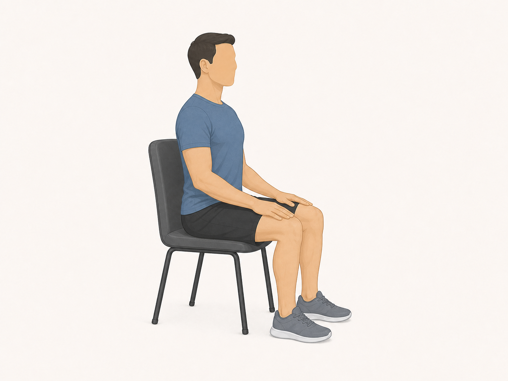
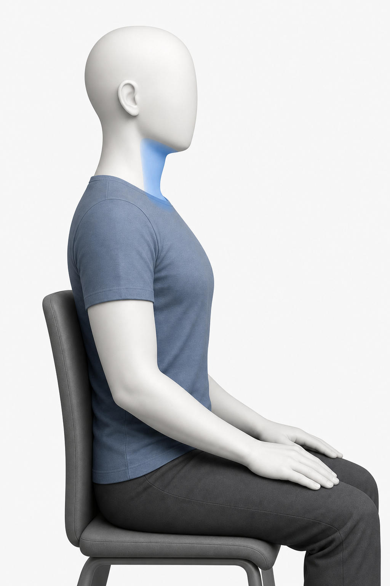
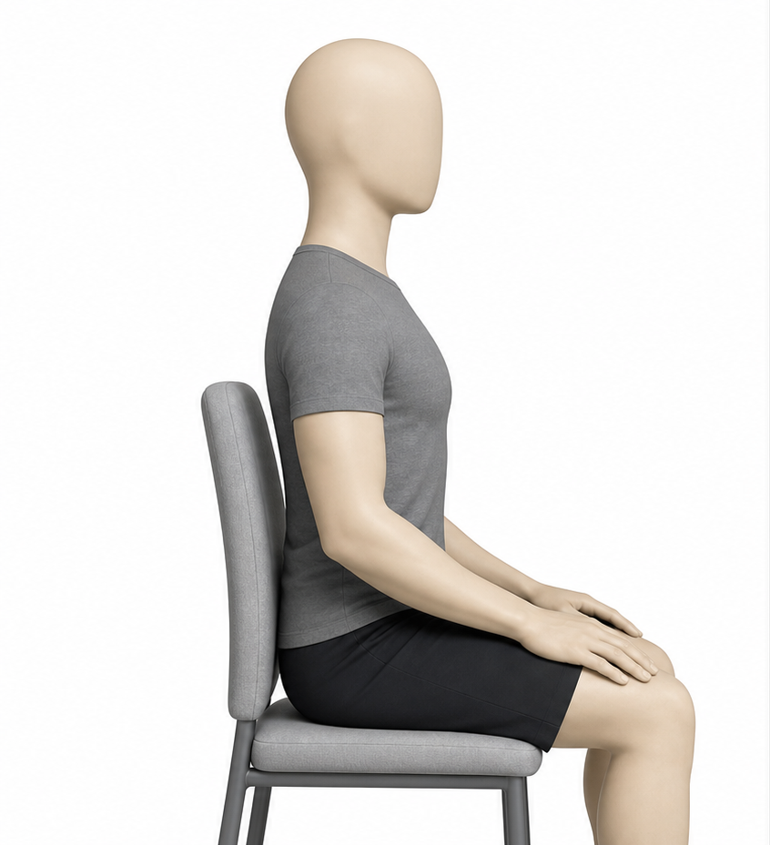
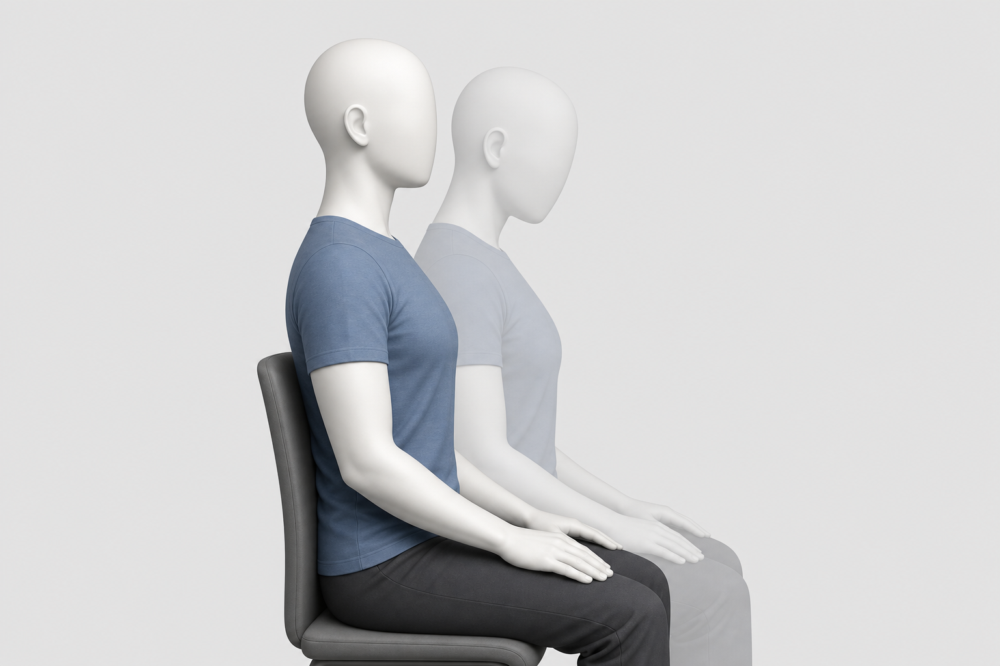
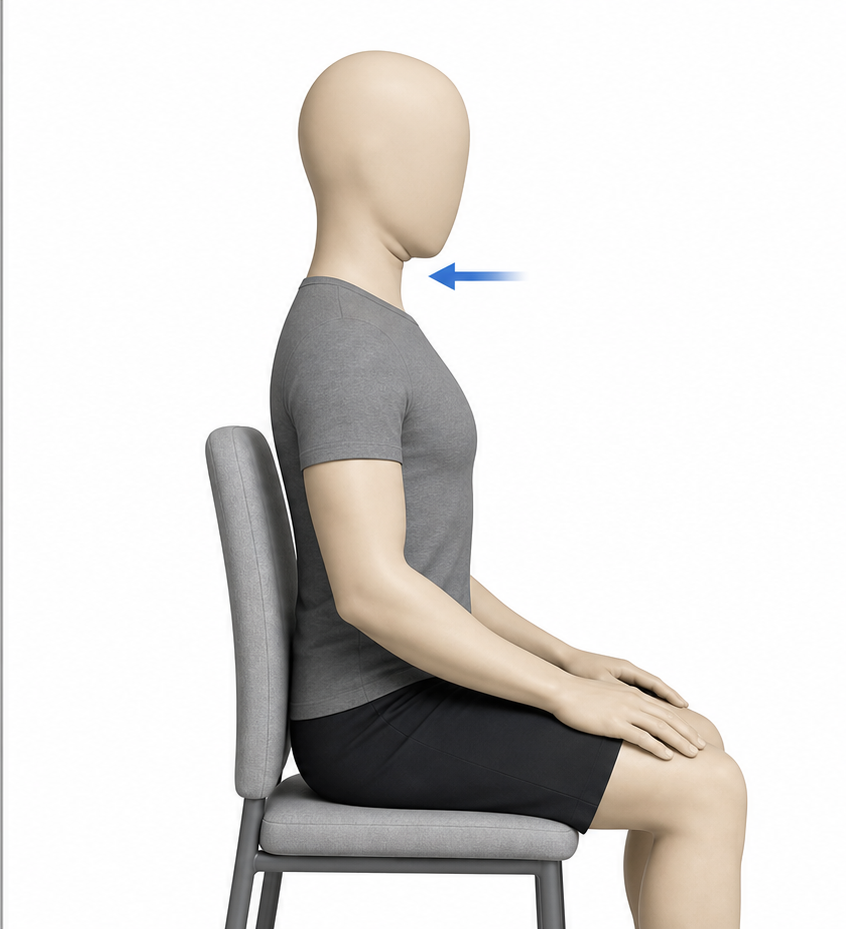

# Chin Nod

Also known as: chin tuck awareness, deep-neck-flexor nod

Author: xiongxianfei
Created: 2026-06-30
Last reviewed: 2026-06-30
Next review due: 2027-06-30
Review scope: sources, scope boundary, exercise contract

Safety routing: see [RED-FLAGS.md](../RED-FLAGS.md) for symptoms or professional-care situations where a static exercise page is the wrong tool.

## What this exercise is for

The chin nod is a low-load neck-control drill. It helps a beginner practice a small head-and-neck motion without turning it into a posture-correction promise. Deep cervical flexor training research uses small craniocervical flexion work as a low-load neck-control exercise context. [Source][local-chin-nod-deep-cervical-flexor]

## Equipment setup

Sit upright with the neck and back straight. Keep the setup easy enough that the head can move a small amount while the shoulders stay relaxed. [Source][local-chin-nod-instruction]

## Muscles involved

- **Control focus:** front-of-neck control muscles, including the deep cervical flexors, help make the chin movement small and smooth. [Source][local-chin-nod-deep-cervical-flexor]
- **Posture support:** nearby neck and upper-back control muscles may help keep the shoulders relaxed while the head moves lightly. [Source][local-chin-nod-instruction]

Treat this as a beginner orientation cue, not a diagnostic anatomy test.

Use the image as a broad attention-region reference. Keep the muscle wording and citations in the Markdown text above.

## Movement breakdown

Use the image as a simple movement reference. Keep following the written setup and safety notes.

### 1. Set up

Sit straight-backed with the eyes looking forward and the jaw relaxed. [Source][local-chin-nod-instruction]

### 2. Move

Gently pull the chin in while keeping the neck and back straight. Do not tip the head forward. [Source][local-chin-nod-instruction]

### 3. Pause

Pause only while the motion still feels light and controlled.

### 4. Return

Return to the starting position slowly. Keep the shoulders quiet instead of shrugging. [Source][local-chin-nod-instruction]

## What you should feel

You may feel light effort near the front of the neck or a mild stretch around the neck. Try to keep the jaw, shoulders, and push effort quiet. [Source][local-chin-nod-instruction]

## Common mistakes

- Tipping the head forward instead of pulling the chin in. [Source][local-chin-nod-instruction]
- Turning the drill into repeated hard pressing instead of a small controlled movement.

## Easier version

Make the chin movement smaller and hold for less time.

## Harder version

Use the same small nod while keeping the ribs and shoulders quiet for a longer pause. Increase control before adding volume or load. [ACSM][acsm-resistance-training]

## How much to do

Method type: low_load_control_drill

For the terms in this section, see [Sets, Reps, Holds, Rest, and Progression](../principles/sets-reps-holds-rest-and-progression.md).

Beginner starting point: Try 1-3 short practice sets of 6-10 slow reps; rest about 30 seconds. [Source][local-chin-nod-instruction]
Effort: Keep the effort low and the motion small enough that the jaw and shoulders stay relaxed. [Source][local-chin-nod-instruction]
Rest: Rest as needed until the next set can stay slow and quiet. [Source][local-chin-nod-instruction]
Progression: Progress by making the nod smoother and more consistent, not by pressing harder or chasing fatigue. [ACSM][acsm-resistance-training]
Stop if: Stop the set when the motion turns into a head tip, jaw tension, shoulder shrugging, or a sharp or unsafe feeling. [NHS][nhs-neck-pain]

## Safety notes

Stop the set if the movement feels sharp, worsening, unusual, or unsafe. Use the red-flags reference for symptoms that call for professional care instead of continuing from a general exercise page. [NHS][nhs-neck-pain]

## Sources

- [NHS - Neck pain and stiff neck][nhs-neck-pain]
- [Mayo Clinic - Weight training technique guidance][mayo-weight-training]
- [Deep cervical flexor training with a pressure biofeedback unit][local-chin-nod-deep-cervical-flexor]
- [Cambridge University Hospitals - Neck exercises and advice][local-chin-nod-instruction]
- [ACSM - Resistance training guidance][acsm-resistance-training]

[nhs-neck-pain]: https://www.nhs.uk/conditions/neck-pain-and-stiff-neck/
[mayo-weight-training]: https://www.mayoclinic.org/healthy-lifestyle/fitness/in-depth/weight-training/art-20045842
[local-chin-nod-deep-cervical-flexor]: https://pmc.ncbi.nlm.nih.gov/articles/PMC4668167/
[local-chin-nod-instruction]: https://www.cuh.nhs.uk/patient-information/neck-exercises-and-advice/
[acsm-resistance-training]: https://acsm.org/resistance-training-guidelines-update-2026/
