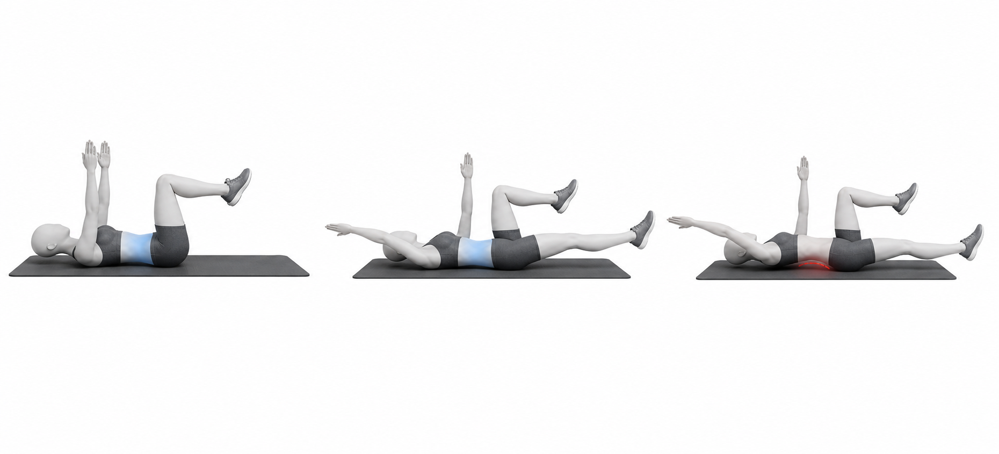

# Dead Bug

Author: xiongxianfei
Created: 2026-06-29
Last reviewed: 2026-06-29
Next review due: 2026-09-27
Review scope: sources, scope boundary, comprehension

## Purpose

Dead bug is a beginner trunk-control exercise. It teaches the reader to move the arms and legs while keeping the ribs, pelvis, and low back organized. That makes it useful on pages that discuss anterior pelvic tilt as a movement-control pattern, not as a diagnosis. [NASM][local-dead-bug-nasm-apt] [Physiopedia][local-dead-bug-physiopedia-apt]

## Used muscles

Primary: rectus abdominis, obliques, and transverse abdominis. Secondary: hip flexors, shoulder flexors, and breathing muscles.

## Equipment and setup

Use the floor or a firm exercise mat. Lie on the back with knees bent over the hips and arms reaching toward the ceiling.

## Movement phases

1. Find a light ribs-down position without holding the breath.
2. Reach one arm and the opposite leg away from the body.
3. Stop before the low back lifts or the ribs flare. [Mayo Clinic][mayo-weight-training]
4. Return slowly and repeat on the other side.

## Important notes

Shorten the arm or leg reach if the low back lifts. The goal is smooth trunk control, not a long reach. General strength-exercise guidance applies: move with control, use a range that can be repeated, and stop for sharp, worsening, unusual, or unsafe symptoms. [Mayo Clinic][mayo-weight-training]

## Example pictures

The image above shows the start position, controlled opposite-arm/opposite-leg reach, and a common mistake where the low back arches as the limb reach becomes too long.

## Patterns and conditions where this exercise appears

- [Anterior Pelvic Tilt](../patterns/anterior-pelvic-tilt.md)

## Sources

- [Mayo Clinic - Weight training technique guidance][mayo-weight-training]
- [NASM - Anterior pelvic tilt overview][local-dead-bug-nasm-apt]
- [Physiopedia - Anterior pelvic tilt][local-dead-bug-physiopedia-apt]

[mayo-weight-training]: https://www.mayoclinic.org/healthy-lifestyle/fitness/in-depth/weight-training/art-20045842
[local-dead-bug-nasm-apt]: https://blog.nasm.org/what-is-anterior-pelvic-tilt-and-how-do-you-fix-it
[local-dead-bug-physiopedia-apt]: https://www.physio-pedia.com/Anterior_Pelvic_Tilt

## Author and review date

xiongxianfei, engineer who reads, not a clinician, 2026-06-29
