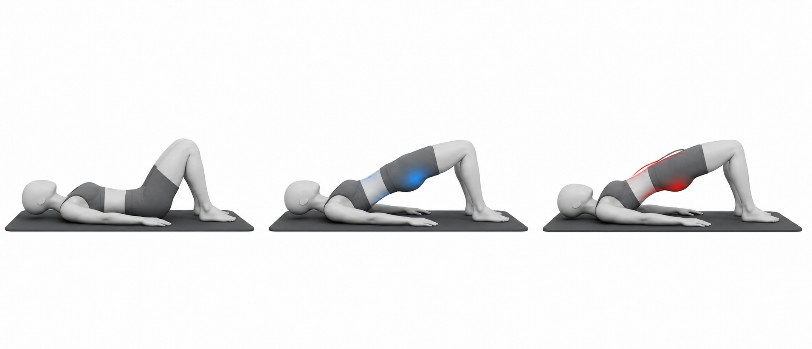

# Glute Bridge

Author: xiongxianfei
Created: 2026-06-29
Last reviewed: 2026-06-29
Next review due: 2026-09-27
Review scope: sources, scope boundary, comprehension

## Purpose

The glute bridge is a beginner hip-extension exercise. It trains the gluteus maximus while the spine stays supported on the floor, which makes it a simple starting point for pages that discuss anterior pelvic tilt and reduced hip-extensor capacity. [NASM][local-glute-bridge-nasm-apt] [Physiopedia][local-glute-bridge-physiopedia-apt]

## Used muscles

Primary: gluteus maximus. Secondary: hamstrings, trunk muscles, and hip adductors.

## Equipment and setup

Use the floor or a firm exercise mat. Lie on the back with knees bent, feet flat, and arms relaxed at the sides.

## Movement phases

1. Set the ribs down and lightly brace.
2. Press through the feet and lift the hips.
3. Stop when the hips are extended and the glutes are working. [Mayo Clinic][mayo-weight-training]
4. Lower with control.

## Important notes

Do not finish the repetition by driving the ribs up or over-arching the low back. The top position should feel like hip extension, not a backbend. General strength-exercise guidance applies: control the movement and stop for sharp, worsening, unusual, or unsafe symptoms. [Mayo Clinic][mayo-weight-training]

## Example pictures

The image above shows the start position, controlled bridge top position, and a common mistake where the low back over-arches.

## Patterns and conditions where this exercise appears

- [Anterior Pelvic Tilt](../patterns/anterior-pelvic-tilt.md)

## Sources

- [Mayo Clinic - Weight training technique guidance][mayo-weight-training]
- [NASM - Anterior pelvic tilt overview][local-glute-bridge-nasm-apt]
- [Physiopedia - Anterior pelvic tilt][local-glute-bridge-physiopedia-apt]

[mayo-weight-training]: https://www.mayoclinic.org/healthy-lifestyle/fitness/in-depth/weight-training/art-20045842
[local-glute-bridge-nasm-apt]: https://blog.nasm.org/what-is-anterior-pelvic-tilt-and-how-do-you-fix-it
[local-glute-bridge-physiopedia-apt]: https://www.physio-pedia.com/Anterior_Pelvic_Tilt

## Author and review date

xiongxianfei, engineer who reads, not a clinician, 2026-06-29
