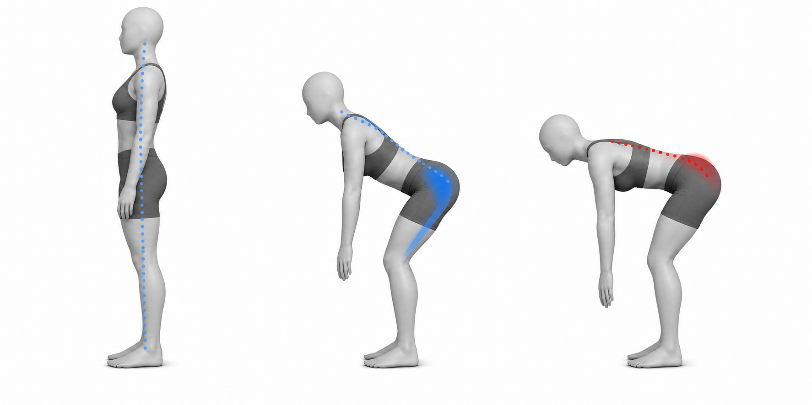
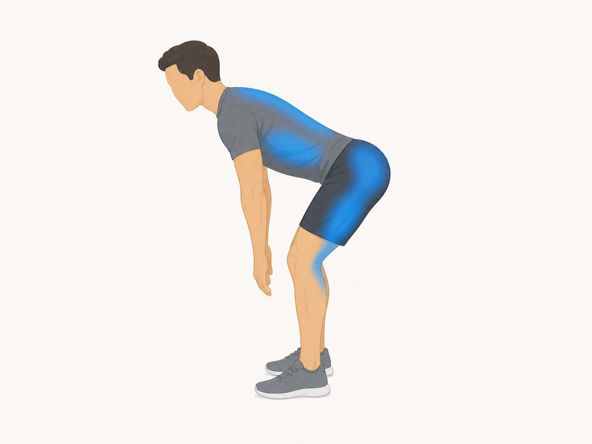
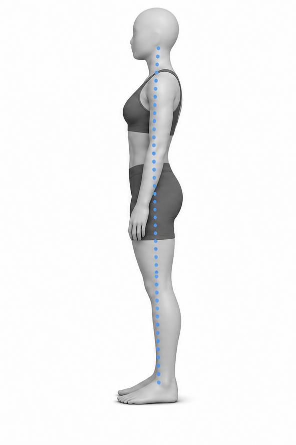
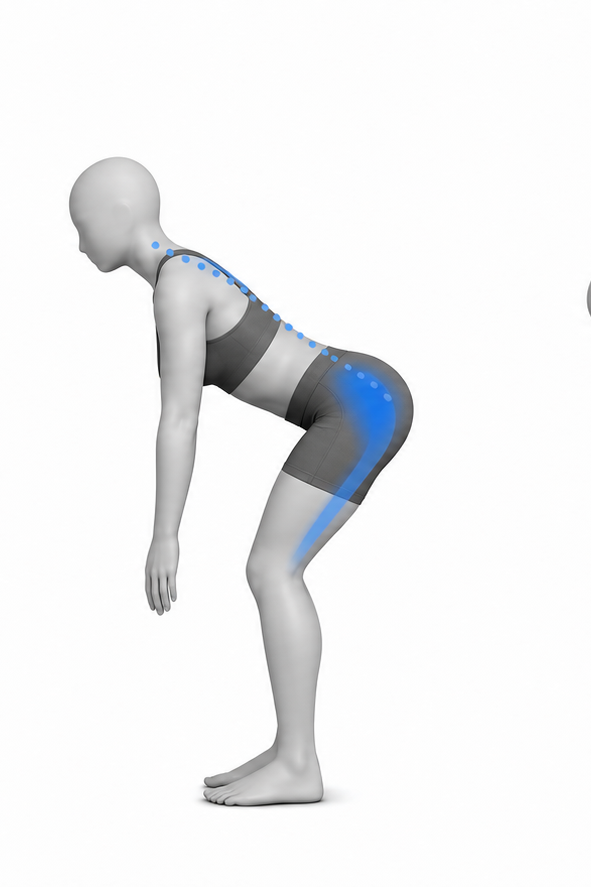
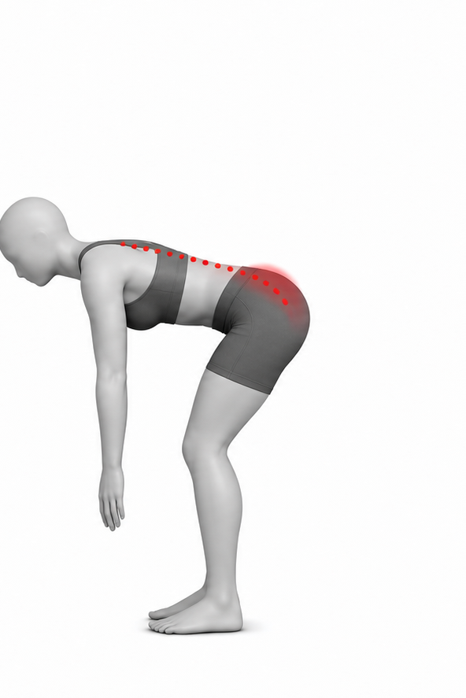

# Hip Hinge

Author: xiongxianfei
Created: 2026-06-29
Last reviewed: 2026-06-29
Next review due: 2026-09-27
Review scope: sources, scope boundary, comprehension

## Purpose

The hip hinge is a beginner movement pattern for bending at the hips while keeping the ribs, pelvis, and spine organized. It prepares the reader for exercises such as Romanian deadlifts without turning the pattern into a load prescription. [NASM][local-hip-hinge-nasm-apt] [Physiopedia][local-hip-hinge-physiopedia-apt]

## Used muscles

Primary: hamstrings and gluteus maximus. Secondary: spinal erectors, trunk muscles, lats, and upper-back muscles.

## Equipment and setup

Use bodyweight first. Stand tall with feet about hip-width apart and hands on the hips or ribs.

## Movement phases

1. Find a tall standing position with the ribs and pelvis stacked.
2. Push the hips back while the knees bend slightly.
3. Keep the torso quiet and stop before the spine changes shape. [Mayo Clinic][mayo-weight-training]
4. Drive the floor away and stand tall.

## Important notes

The hinge comes from the hips, not from collapsing or over-arching the low back. Use a shorter range until the movement is repeatable. General strength-exercise guidance applies: control each repetition and stop for sharp, worsening, unusual, or unsafe symptoms. [Mayo Clinic][mayo-weight-training]

## Example pictures

The image above shows the tall start, the hips-back hinge, and a common mistake where the low back rounds or over-arches instead of the hips moving back.

## Patterns and conditions where this exercise appears

- [Anterior Pelvic Tilt](../patterns/anterior-pelvic-tilt.md)

## Sources

- [Mayo Clinic - Weight training technique guidance][mayo-weight-training]
- [NASM - Anterior pelvic tilt overview][local-hip-hinge-nasm-apt]
- [Physiopedia - Anterior pelvic tilt][local-hip-hinge-physiopedia-apt]

[mayo-weight-training]: https://www.mayoclinic.org/healthy-lifestyle/fitness/in-depth/weight-training/art-20045842
[local-hip-hinge-nasm-apt]: https://blog.nasm.org/what-is-anterior-pelvic-tilt-and-how-do-you-fix-it
[local-hip-hinge-physiopedia-apt]: https://www.physio-pedia.com/Anterior_Pelvic_Tilt

## Author and review date

xiongxianfei, engineer who reads, not a clinician, 2026-06-29
