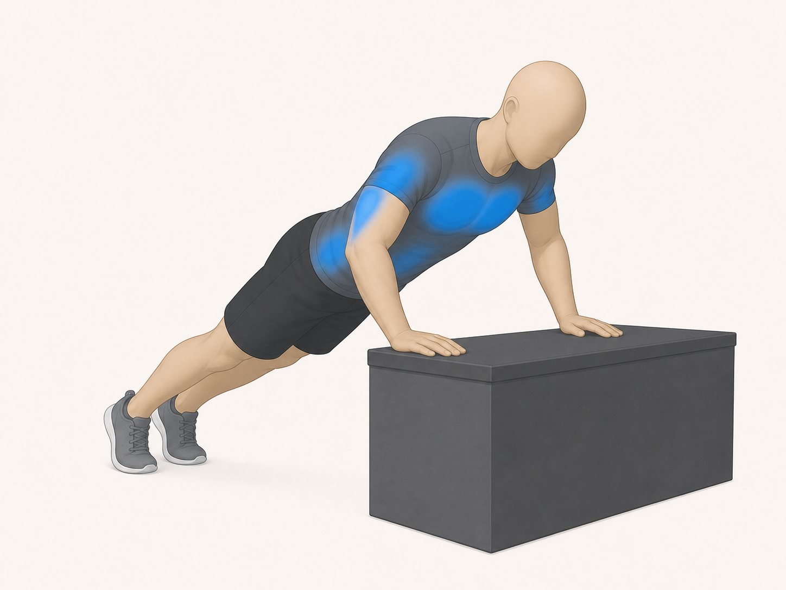
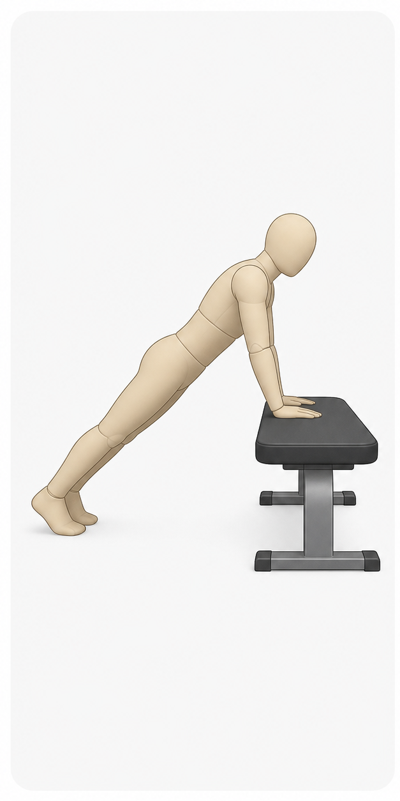
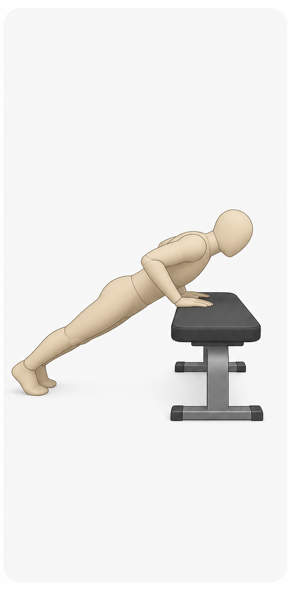
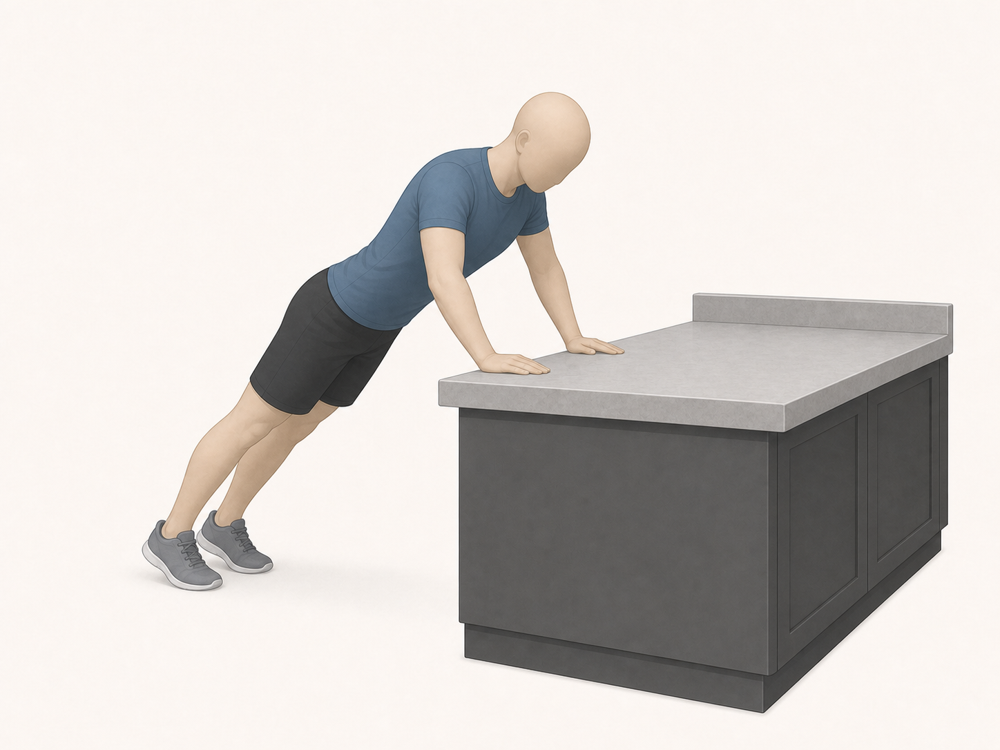

# Incline Push-Up

Author: xiongxianfei
Created: 2026-06-30
Last reviewed: 2026-06-30
Next review due: 2027-06-30
Review scope: sources, scope boundary, comprehension

> Disclaimer: GymPrimer is educational content for general exercise literacy.
> It is not medical advice and not personalized coaching.

## What this exercise is for

The incline push-up is a beginner bodyweight pushing exercise. It uses a sturdy
raised surface so the movement is easier than doing the same pattern from the
floor.

## Equipment setup

Use a stable surface that will not slide, such as a fixed rail, counter, or
heavy box. Place both hands on the surface and step back until your body forms
a straight line from head to heels.

## Muscles involved

You should mostly notice work across the chest, front of the shoulders, backs
of the upper arms, and trunk muscles that help keep your body steady.

## Movement breakdown

Use the image as a simple start-and-finish reference. Keep following the written
setup and safety notes, because a picture cannot show whether a surface is
stable in your gym.

### 1. Set up

Place your hands a little wider than shoulder width and keep your feet on the floor.

### 2. Move

Bend your elbows and lower your chest toward the raised surface.

### 3. Pause

Pause briefly when you reach a comfortable low point.

### 4. Return

Press the surface away and return to the starting position with control.
Controlled movement is part of good weight-training technique.
[Mayo Clinic][mayo-weight-training]

## What you should feel

You should feel a steady push through the front of the upper body while your
torso stays firm. If your hips sag or the surface shifts, use a higher or more
stable surface.

## Common mistakes

- Choosing a surface that can slide.
- Letting the hips drop during the repetition.
- Shrugging the shoulders toward the ears.
- Moving faster than you can control.

## Easier version

Use a higher surface so less of your body weight is involved.

## Harder version

Use a slightly lower stable surface while keeping the same controlled movement.

## How much to do

Method type: bodyweight_progression

For the terms in this section, see [Sets, Reps, Holds, Rest, and Progression](../principles/sets-reps-holds-rest-and-progression.md).

Beginner starting point: Try 1-3 easy sets of 5-12 controlled repetitions from a surface high enough that the body line stays steady. [Mayo Clinic][mayo-weight-training]
Effort: Choose a height that feels controlled rather than a low surface that makes the hips sag. [Mayo Clinic][mayo-weight-training]
Rest: Rest about 60 seconds between sets. [ACSM][acsm-resistance-training]
Progression: Lower the hand surface a little only after the current height is repeatable with clean control. [ACSM][acsm-resistance-training]
Stop if: Stop the set when the surface shifts, the hips sag, or the press back up is no longer controlled. [Mayo Clinic][mayo-weight-training]

## Safety notes

Stop if sharp or unsafe. [Mayo Clinic][mayo-weight-training]

## Sources

- [Mayo Clinic weight training technique guidance][mayo-weight-training]
- [Mayo Clinic weight training setup reference][local-incline-push-up-setup]
- [Mayo Clinic weight training safety reference][local-incline-push-up-safety]
- [ACSM resistance training guidance][acsm-resistance-training]

[mayo-weight-training]: https://www.mayoclinic.org/healthy-lifestyle/fitness/in-depth/weight-training/art-20045842
[local-incline-push-up-setup]: https://www.mayoclinic.org/healthy-lifestyle/fitness/in-depth/weight-training/art-20045842
[local-incline-push-up-safety]: https://www.mayoclinic.org/healthy-lifestyle/fitness/in-depth/weight-training/art-20045842
[acsm-resistance-training]: https://acsm.org/resistance-training-guidelines-update-2026/
