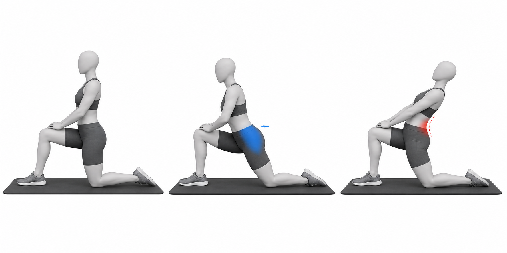

# Kneeling Hip-Flexor Stretch

Author: xiongxianfei
Created: 2026-06-29
Last reviewed: 2026-06-29
Next review due: 2026-09-27
Review scope: sources, scope boundary, comprehension

## Purpose

The kneeling hip-flexor stretch is a beginner mobility exercise for the front of the hip. In anterior pelvic tilt education, it is an option for exploring hip-flexor stiffness or tone, not proof that the hip flexors caused the pattern. [NASM][local-kneeling-hip-flexor-stretch-nasm-apt] [Physiopedia][local-kneeling-hip-flexor-stretch-physiopedia-apt]

## Used muscles

Primary stretch target: iliopsoas and rectus femoris on the rear leg. Positioning muscles: gluteus maximus, trunk muscles, and quadriceps.

## Equipment and setup

Use a mat or pad under the rear knee. Set up in a half-kneeling position with one knee down and the other foot flat in front.

## Movement phases

1. Lightly squeeze the rear glute.
2. Tuck the pelvis just enough to reduce low-back arching.
3. Shift the body forward until the front of the rear hip feels a mild stretch.
4. Breathe and hold without leaning backward.

## Important notes

Do not chase a stronger stretch by arching the low back. The stretch should stay near the front of the rear hip. General mobility guidance applies: use a mild, controllable position and stop for sharp, worsening, unusual, or unsafe symptoms. [Mayo Clinic][mayo-weight-training]

## Example pictures

The image above shows the setup, the controlled stretch position, and a common mistake where the reader leans back and loads the low back instead of the hip flexor.

## Patterns and conditions where this exercise appears

- [Anterior Pelvic Tilt](../patterns/anterior-pelvic-tilt.md)

## Sources

- [Mayo Clinic - Weight training technique guidance][mayo-weight-training]
- [NASM - Anterior pelvic tilt overview][local-kneeling-hip-flexor-stretch-nasm-apt]
- [Physiopedia - Anterior pelvic tilt][local-kneeling-hip-flexor-stretch-physiopedia-apt]

[mayo-weight-training]: https://www.mayoclinic.org/healthy-lifestyle/fitness/in-depth/weight-training/art-20045842
[local-kneeling-hip-flexor-stretch-nasm-apt]: https://blog.nasm.org/what-is-anterior-pelvic-tilt-and-how-do-you-fix-it
[local-kneeling-hip-flexor-stretch-physiopedia-apt]: https://www.physio-pedia.com/Anterior_Pelvic_Tilt

## Author and review date

xiongxianfei, engineer who reads, not a clinician, 2026-06-29
