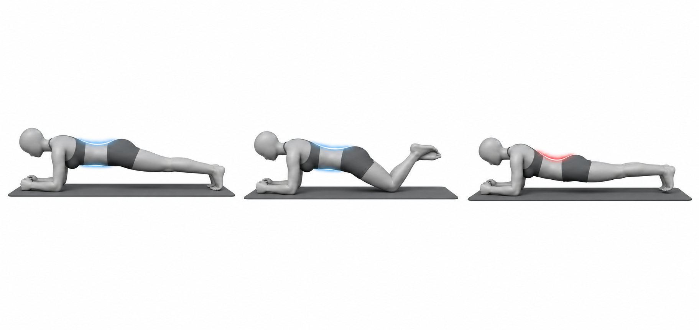
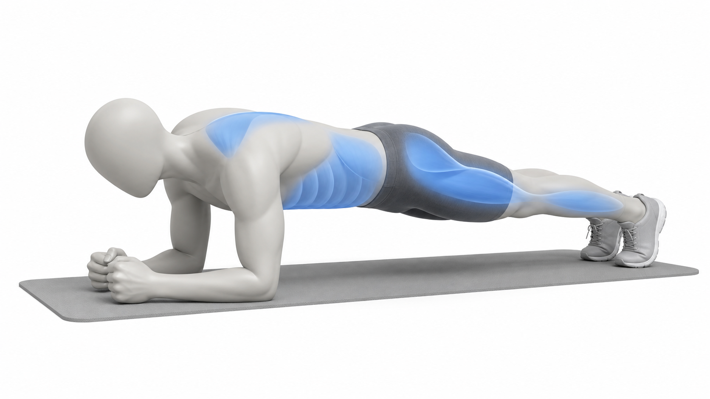

# Plank

Author: xiongxianfei
Created: 2026-06-29
Last reviewed: 2026-06-29
Next review due: 2026-09-27
Review scope: sources, scope boundary, comprehension

## Purpose

The plank is an isometric trunk-control exercise. It teaches the reader to hold the ribs and pelvis together under whole-body load, which is why it can support pattern education around anterior pelvic tilt when framed as general training, not a posture cure. [NASM][local-plank-nasm-apt] [Physiopedia][local-plank-physiopedia-apt]

## Muscles involved

| Role | Muscle region | What it helps do |
|---|---|---|
| Main control | Abdomen and side trunk | Help keep the ribs and pelvis steady while you hold the line. [Mayo Clinic][mayo-weight-training] |
| Support | Glutes and shoulders | Help hold the body position without turning the hold into a low-back arch. [Mayo Clinic][mayo-weight-training] |
| Stabilizer | Legs and upper back | Help keep the knees, hips, and shoulders organized during the hold. [Mayo Clinic][mayo-weight-training] |

Treat these as broad regions to notice, not a test of exact muscle activation.
Use the muscle-attention image only as a broad region reference.

## Equipment and setup

Use the floor or a firm exercise mat. Set elbows under the shoulders and extend the legs behind the body.

## Movement phases

1. Brace lightly around the trunk while breathing.
2. Lift the knees so the body forms a long line from shoulders to heels.
3. Hold without letting the hips sag or the ribs flare.
4. Lower before form changes.

## What you should feel

You may feel steady effort around the abdomen and side trunk while breathing
stays normal. Pay attention to keeping the ribs and pelvis connected instead of
letting the low back arch, hips sag, or shoulders take over.

## How much to do

Method type: isometric_hold

For the terms in this section, see [Sets, Reps, Holds, Rest, and Progression](../principles/sets-reps-holds-rest-and-progression.md).

Beginner starting point: Try 2-3 holds of 10-30 seconds. Use a knee plank or shorter hold if the full version changes shape. [Mayo Clinic][mayo-weight-training]
Effort: Keep breathing normal and the hold steady rather than maxing out. [Mayo Clinic][mayo-weight-training]
Rest: Rest 45-60 seconds between holds. [Mayo Clinic][mayo-weight-training]
Progression: Add a few seconds before choosing a harder variation. [Mayo Clinic][mayo-weight-training]
Stop if: Stop the hold when the hips sag, the ribs flare, breathing gets stuck, or the position feels sharp or unsafe. [Mayo Clinic][mayo-weight-training]

## Important notes

Use a shorter hold or a knee plank when the hips sag. The useful version is the one the reader can control. General strength-exercise guidance applies: move and hold with control, use a repeatable difficulty, and stop for sharp, worsening, unusual, or unsafe symptoms. [Mayo Clinic][mayo-weight-training]

## Example pictures

The image above shows a controlled plank, a shorter knee-plank option, and a common mistake where the hips sag and the low back over-arches.

## Patterns and conditions where this exercise appears

- [Anterior Pelvic Tilt](../patterns/anterior-pelvic-tilt.md)

## Sources

- [Mayo Clinic - Weight training technique guidance][mayo-weight-training]
- [NASM - Anterior pelvic tilt overview][local-plank-nasm-apt]
- [Physiopedia - Anterior pelvic tilt][local-plank-physiopedia-apt]

[mayo-weight-training]: https://www.mayoclinic.org/healthy-lifestyle/fitness/in-depth/weight-training/art-20045842
[local-plank-nasm-apt]: https://blog.nasm.org/what-is-anterior-pelvic-tilt-and-how-do-you-fix-it
[local-plank-physiopedia-apt]: https://www.physio-pedia.com/Anterior_Pelvic_Tilt

## Author and review date

xiongxianfei, engineer who reads, not a clinician, 2026-06-29
