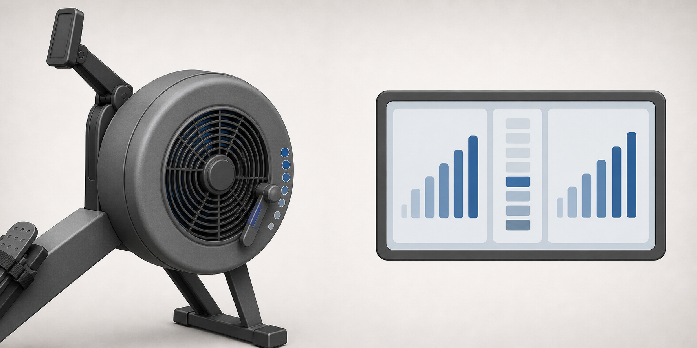
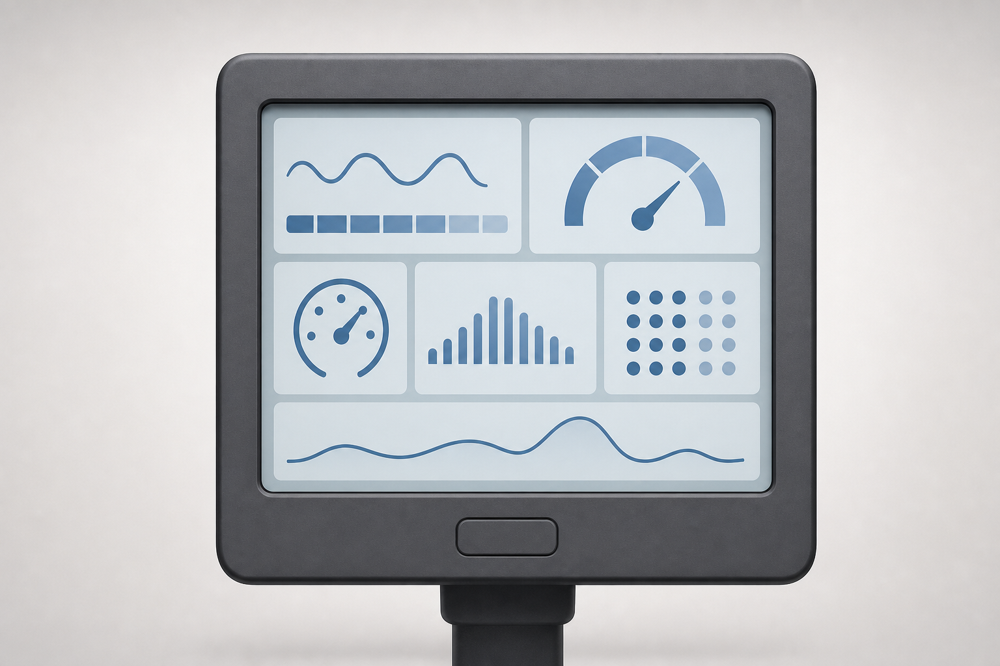
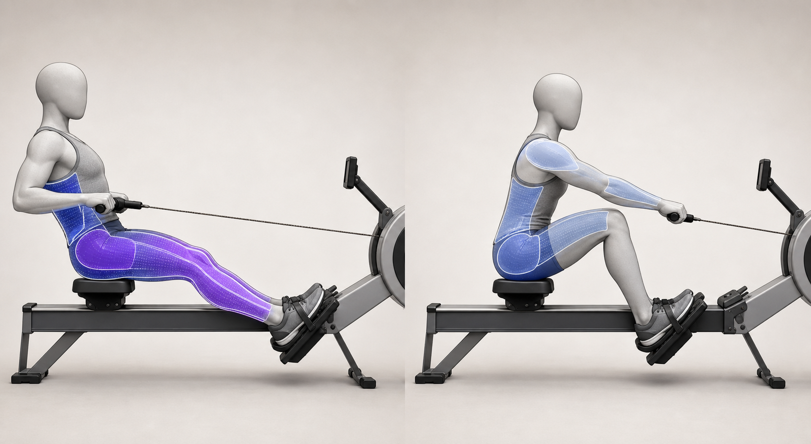
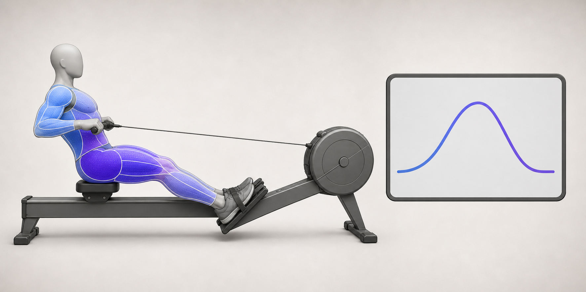
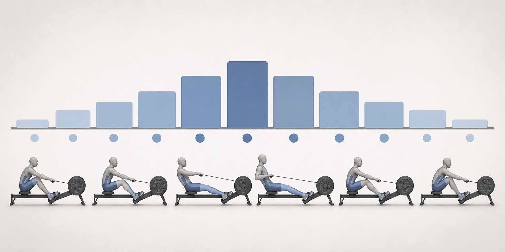
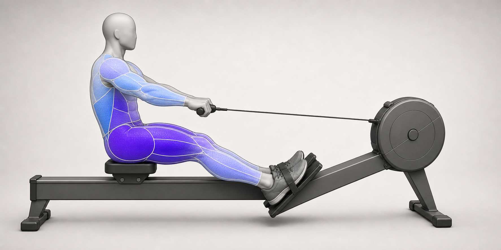
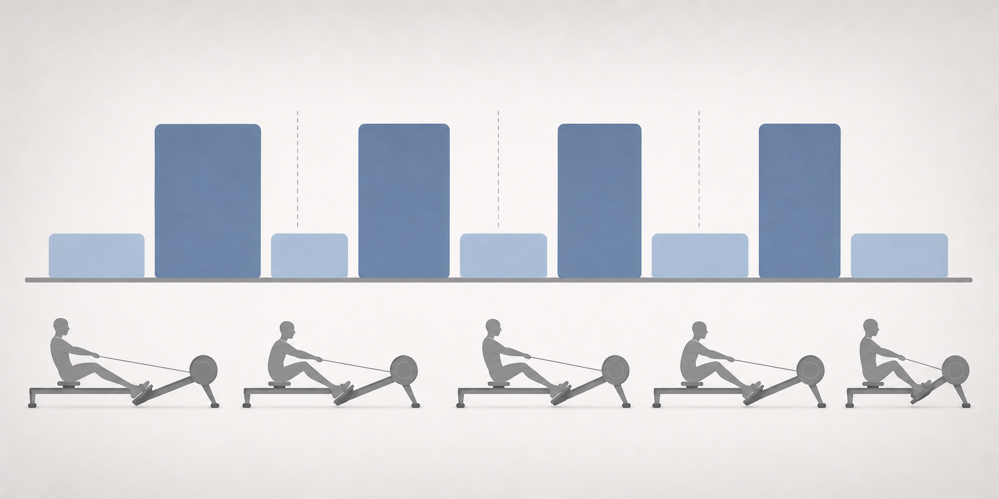
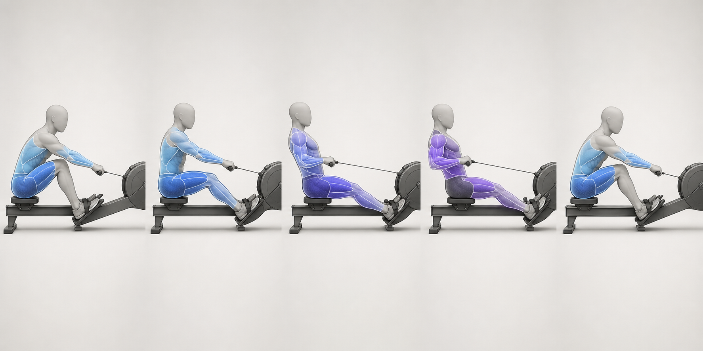

# Rowing Machine: Advanced Technique and Workouts

Author: xiongxianfei
Created: 2026-07-07
Last reviewed: 2026-07-07
Next review due: 2027-07-07
Review scope: sources, scope boundary, comprehension, media planning

> Disclaimer: GymPrimer is educational content for general exercise literacy.
> It is not medical advice and not personalized coaching.

## What this page is for

Use this page after the beginner rowing-machine page when the basic stroke
already feels organized. The goal is advanced exercise literacy: understanding
how damper feel, drag factor, monitor metrics, rhythm, force-curve feedback,
stroke rate, and static workout types relate to a cleaner indoor-rowing
practice.

This page is still a Markdown tutorial. It does not need software, account
setup, data upload, or generated media to be readable.

## What this page is not

This page is not a weekly schedule, racing tactics guide, clinical protocol,
or promise that a specific benchmark outcome will happen.

It does not choose paces, watts, test outcomes, training frequency, or progress
steps for an individual reader. When benchmark preparation is mentioned, the
page points readers toward official plans instead of writing one here.

## Prerequisites

Use this page only after you can row 10-15 minutes with a smooth stroke and can
explain the sequence:

```text
Drive: legs -> body -> arms
Recovery: arms -> body -> legs
```

This is an editorial boundary. It is not a medical, safety, performance, or
eligibility test. If the sequence is not yet clear, use the beginner page first.

## Advanced setup: damper and drag factor

The damper changes how much air reaches the flywheel, so it changes the feel of
the stroke. Concept2 distinguishes this from intensity: the work still comes
from how hard the rower pulls. [Concept2][concept2-advanced-damper-drag-factor]

Drag factor is a measured flywheel value. It is useful because two machines can
feel different at the same damper number, while drag factor gives a more
comparable machine-to-machine reference. [Concept2][concept2-advanced-damper-drag-factor]

Do not use damper 10 as proof of strength or better rowing. Concept2 recommends
starting around damper 3-5 while technique is the priority.
[Concept2][concept2-advanced-damper-drag-factor]

### Damper and drag factor image guide



No in-image labels are required. Markdown and alt text carry the labels: damper
changes flywheel feel; drag factor is the comparable flywheel feedback concept.

## Monitor basics: split, watts, stroke rate, and distance

The monitor is useful only when the numbers are read as feedback, not as an
identity score. Concept2 documents display options that include pace, watts,
stroke rate, distance/time, and force curve. [Concept2][concept2-pm5-how-to-use]
[Concept2][concept2-understanding-pm5]

| Metric | What it means | How to use it |
|---|---|---|
| Split or pace per 500m | The time pace for 500 meters; lower is faster. | Compare efforts when technique stays similar. [Concept2][concept2-pm5-how-to-use] |
| Watts | A power output number; higher watts means more power. | See whether stronger strokes actually change output. [Concept2][concept2-pm5-how-to-use] |
| Stroke rate | Strokes per minute. | Separate cadence from effort instead of assuming faster rate is better. [Concept2][concept2-stroke-rate-explained] |
| Distance/time | The total distance or elapsed time. | Keep the work target simple and static. [Concept2][concept2-understanding-pm5] |
| Force curve | A graph of power application through the stroke. | Notice whether power is applied smoothly. [Concept2][concept2-pm5-how-to-use] |

These metrics are concepts. They are not personal pace prescriptions.

### Monitor metrics image guide



No in-image labels are required. Markdown and alt text carry the labels: split
or pace per 500m, watts, stroke rate, distance/time, and force curve.

## Rhythm and recovery ratio

Advanced rowing is not just harder pulling. A useful rhythm is a decisive drive
followed by a controlled recovery. Concept2 describes a one-count drive and
two-count recovery, and British Rowing says the recovery should ideally take
twice as long as the explosive drive phase. [Concept2][concept2-pm5-how-to-use]
[British Rowing][british-rowing-technique]

Use the rhythm to keep the slide from rushing. If the seat returns faster than
the handle and body can organize, lower the stroke rate and rebuild the
sequence.

### Rhythm ratio image guide



Color intensity guide:
- Level 0: not emphasized in this phase
- Level 1: low control role
- Level 2: moderate support role
- Level 3: primary effort role

This is a relative teaching guide, not a force measurement. The image uses
stronger emphasis on the drive and quieter emphasis on the recovery to show
rhythm, not correctness.

## Force curve and power application

The force curve can help you notice how power is applied during a stroke.
Concept2 describes it as a graph of power application. [Concept2][concept2-pm5-how-to-use]

Treat the curve as feedback, not a form verdict. It cannot diagnose why a
stroke looks different, and it cannot replace practice with the sequence,
or outside technique feedback when available.

### Force curve image guide



Color intensity guide:
- Level 0: not emphasized in this phase
- Level 1: low control role
- Level 2: moderate support role
- Level 3: primary effort role

This is a relative teaching guide, not a force measurement. The image pairs
broad body emphasis with a generic curve concept so the curve stays feedback,
not a diagnosis.

## Stroke-rate control

Stroke rate is the number of strokes per minute. Concept2 warns that intensity
depends on how hard the rower pulls, not cadence alone, and that higher rates
are harder to coordinate well. [Concept2][concept2-stroke-rate-explained]

Higher stroke rate is not automatically higher quality. Higher stroke rate is
not automatically higher intensity. First hold posture, sequence, and split at
lower rates; then raise the rate only when the stroke stays organized.

Concept2 describes broad examples: lower rates for technique work, moderate
rates for steady rowing, and higher rates for shorter or racing-oriented work.
Use those as context, not universal targets. [Concept2][concept2-stroke-rate-explained]

### Stroke-rate ladder image guide



No in-image labels are required. Markdown and alt text carry the labels: lower,
moderate, and higher rate blocks are structure cues for practice, not quality
scores.

## Workout types

Method type: basic_cardio_equipment

These are static examples for understanding workout types. They are not a training plan, and they do not set personal paces, watts, weekly frequency, or benchmark outcomes.

| Workout type | Static example | Main lesson |
|---|---|---|
| Steady aerobic rows | 20-30 minutes at an easy-to-sustainable effort. | Hold rhythm and technique without chasing a number. [Concept2][concept2-workout-of-day] |
| Rate ladders | Several short blocks at different stroke rates. | Learn how rate changes feel while the stroke remains organized. [Concept2][concept2-stroke-rate-explained] |
| Power-per-stroke work | Low-rate rowing with a strong controlled drive. | Create power through a connected drive rather than rushing the slide. [British Rowing][british-rowing-technique] |
| Intervals | Work/rest formats such as several 3-5 minute repeats, with rest as very easy rowing. | Practice returning to smooth strokes after work blocks. [Concept2][concept2-understanding-pm5] [Concept2][concept2-2k-plan] |
| Benchmark preparation | Review official plans and learn the monitor terms before testing. | Keep GymPrimer at literacy level instead of writing a full schedule. [Concept2][concept2-2k-plan] |

For structured benchmark work, use official plans from Concept2 or qualified
instruction rather than treating this page as a plan. [Concept2][concept2-2k-plan]

### Power per stroke image guide



Color intensity guide:
- Level 0: not emphasized in this phase
- Level 1: low control role
- Level 2: moderate support role
- Level 3: primary effort role

This is a relative teaching guide, not a force measurement. The image emphasizes
the leg and trunk connection during a controlled drive without implying that a
reader should row harder every stroke.

### Interval structure image guide



No in-image labels are required. Markdown and alt text carry the labels: taller
blocks represent static work examples, shorter blocks represent very easy
rowing rest, and the diagram is not a weekly schedule.

## Muscles involved

British Rowing describes the drive sequence as legs, body, arms and the recovery
as arms, body, legs. It also gives a broad power split of legs first, then body,
then arms. [British Rowing][british-rowing-technique]

| Phase | Muscle region | What it helps do |
|---|---|---|
| Catch | Trunk posture, relaxed arms and grip | Set a long, organized position before the push. |
| Drive: leg push | Legs and glutes, with trunk support | Start the work through the footplates. |
| Drive: body swing | Trunk, hips, and tapering leg drive | Transfer the leg push into a connected handle path. |
| Finish | Upper back, lats, and arms, with trunk support | Complete the handle movement near the lower ribs. |
| Recovery | Trunk, hips, arms, shoulders, and slide control | Return under control without rushing the next catch. |

Treat this table as broad muscle literacy, not an exact activation map.

## What you should feel

You may feel a strong but organized drive, a quieter recovery, and a monitor
response that changes when the stroke becomes more connected. The effort should
feel purposeful without turning the recovery into a race back up the slide.

You should not need to yank the handle, max out the damper, or chase stroke rate
to make the row more productive.

## Common advanced mistakes

| Mistake | Why it matters | Better cue |
|---|---|---|
| Treating damper 10 as superior | Damper changes feel; it is not a strength score. | Use technique and drag factor for consistency. |
| Chasing stroke rate | Higher cadence can hide a weak sequence. | Keep rhythm and split organized before raising rate. |
| Over-reading the force curve | A curve is feedback, not a diagnosis. | Use it with stroke-sequence practice. |
| Rushing recovery | It compresses the next catch and makes timing harder. | Let the recovery take longer than the drive. |
| Turning intervals into a schedule | Static examples can become over-specific quickly. | Keep examples educational or use official plans. |
| Pulling early with the arms | It breaks the legs -> body -> arms sequence. | Push first, swing second, pull last. |

## High-quality image guide

Future advanced rowing images should teach one concept at a time. The first
approved batch is limited to stroke timing, rhythm ratio, monitor metrics,
force curve, stroke-rate ladder, damper and drag factor, power per stroke, and
interval structure.

Body, movement, muscle, and force-intensity images should not contain labels
inside the image. Monitor, graph, and interval diagrams may use minimal labels
only when the same information is repeated in Markdown and alt text.

Do not use copied PM5 UI, screenshots, logos or brand marks, identifiable
people, correct/wrong badges, red pain marks, elite or race-win framing, or
unsupported outcome claims. Generated images need prompt records, provenance, visual
review, meaningful alt text, and nearby Markdown before promotion.

## Force-intensity visual system

Advanced rowing images may use a 0-3 relative scale as relative instructional emphasis for broad muscle effort across stroke phases.

The color system is instructional. It is not exact force output, not EMG activation, not injury risk, and not proof of correct form.

| Level | Meaning | Visual treatment |
|---:|---|---|
| 0 | Not emphasized in this phase | Neutral body color |
| 1 | Low control or stabilizing role | Light tint plus thin outline |
| 2 | Moderate support role | Medium tint plus medium outline |
| 3 | Primary effort or main driver | Strong tint plus thicker outline or texture |

Do not convey force intensity by color alone. Any image using this system needs
a Markdown legend, alt text, a phase table or nearby explanation, and visual
differences that remain understandable in grayscale. This follows W3C guidance
that color should not be the only way information is conveyed.
[W3C][w3c-use-of-color]

Avoid red pain-map styling. Prefer a blue or purple intensity scale with
outline or texture differences.

## Rowing phase force map

Use this as a broad teaching model for future force-intensity images. It should
be checked against the cited rowing sequence before image promotion.

| Stroke phase | Level 3 primary effort | Level 2 support | Level 1 control |
|---|---|---|---|
| Catch | None; ready position | Trunk posture | Arms long, grip relaxed |
| Drive: leg push | Legs and glutes | Trunk | Upper back and arms |
| Drive: body swing | Legs and glutes tapering | Trunk and hips | Upper back and arms |
| Finish | Upper back, lats, and arms | Trunk | Legs extended, grip controlled |
| Recovery | None; low effort | Trunk and hips | Arms, shoulders, and slide control |

The map is relative and educational. It is not a measurement of real force.

### Stroke timing image guide



Color intensity guide:
- Level 0: not emphasized in this phase
- Level 1: low control role
- Level 2: moderate support role
- Level 3: primary effort role

This is a relative teaching guide, not a force measurement. Use it with the
phase force map above: legs and glutes are most emphasized early in the drive,
the trunk supports transfer, and upper back, lats, and arms rise near the
finish.

## Safety notes

Stop rowing and use the central [Red Flags](../RED-FLAGS.md) page if you notice chest pain, dizziness, fainting, unusual shortness of breath, sharp pain, numbness, or symptoms that worsen. [Mayo Clinic][mayo-heart-attack-symptoms] [Mayo Clinic][mayo-exercise-arthritis-pain]

Stop the session if the movement becomes painful, jerky, or uncontrolled; exercise technique should stay controlled, and exercise that causes pain should stop. [Mayo Clinic][mayo-weight-training]

For a health condition or clinician-directed restriction, use clinician guidance instead of this general tutorial. [Mayo Clinic][mayo-exercise-chronic-disease]

## Sources

- [Concept2 PM5 how-to guide][concept2-pm5-how-to-use]
- [Concept2 Understanding the PM5][concept2-understanding-pm5]
- [Concept2 stroke-rate explanation][concept2-stroke-rate-explained]
- [Concept2 damper setting and drag factor guidance][concept2-advanced-damper-drag-factor]
- [Concept2 Workout of the Day guidance][concept2-workout-of-day]
- [Concept2 2k erg test training plan][concept2-2k-plan]
- [British Rowing technique guide][british-rowing-technique]
- [W3C Use of Color guidance][w3c-use-of-color]
- [Mayo Clinic heart attack symptoms reference][mayo-heart-attack-symptoms]
- [Mayo Clinic exercise and arthritis pain guidance][mayo-exercise-arthritis-pain]
- [Mayo Clinic exercise and chronic disease guidance][mayo-exercise-chronic-disease]
- [Mayo Clinic weight training technique guidance][mayo-weight-training]

[concept2-pm5-how-to-use]: https://concept2.com/support/monitors/pm5/how-to-use
[concept2-understanding-pm5]: https://concept2.com/training/articles/understanding-pm5
[concept2-stroke-rate-explained]: https://concept2.com/blog/rowing-stroke-rate-explained
[concept2-advanced-damper-drag-factor]: https://concept2.com/training/articles/damper-setting
[concept2-workout-of-day]: https://concept2.com/training/wod
[concept2-2k-plan]: https://concept2.com/training/plans/2k-erg-test-12-week
[british-rowing-technique]: https://www.britishrowing.org/indoor-rowing/go-row-indoor/how-to-indoor-row/british-rowing-technique/
[w3c-use-of-color]: https://www.w3.org/WAI/WCAG21/Understanding/use-of-color.html
[mayo-heart-attack-symptoms]: https://www.mayoclinic.org/diseases-conditions/heart-attack/in-depth/heart-attack-symptoms/art-20047744
[mayo-exercise-arthritis-pain]: https://www.mayoclinic.org/diseases-conditions/arthritis/in-depth/arthritis/art-20047971
[mayo-exercise-chronic-disease]: https://www.mayoclinic.org/healthy-lifestyle/fitness/in-depth/exercise-and-chronic-disease/art-20046049
[mayo-weight-training]: https://www.mayoclinic.org/healthy-lifestyle/fitness/in-depth/weight-training/art-20045842
