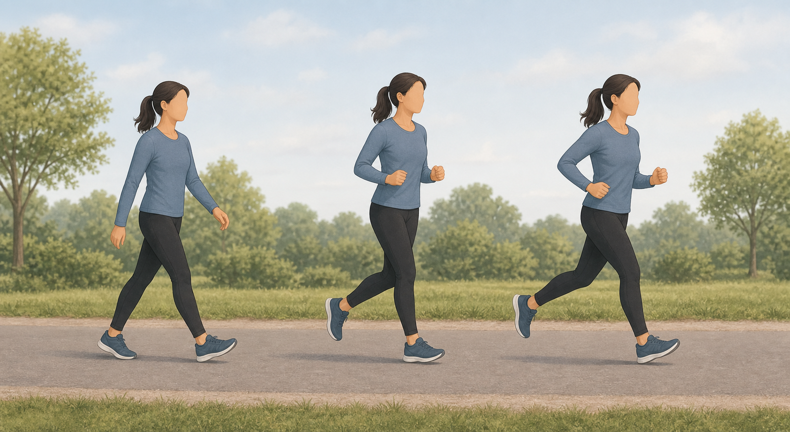
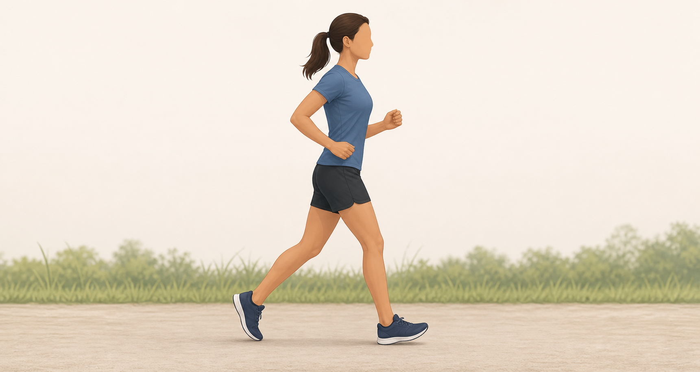
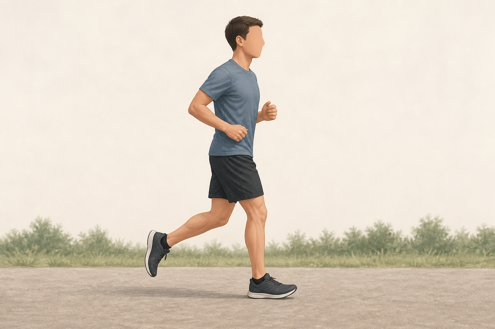
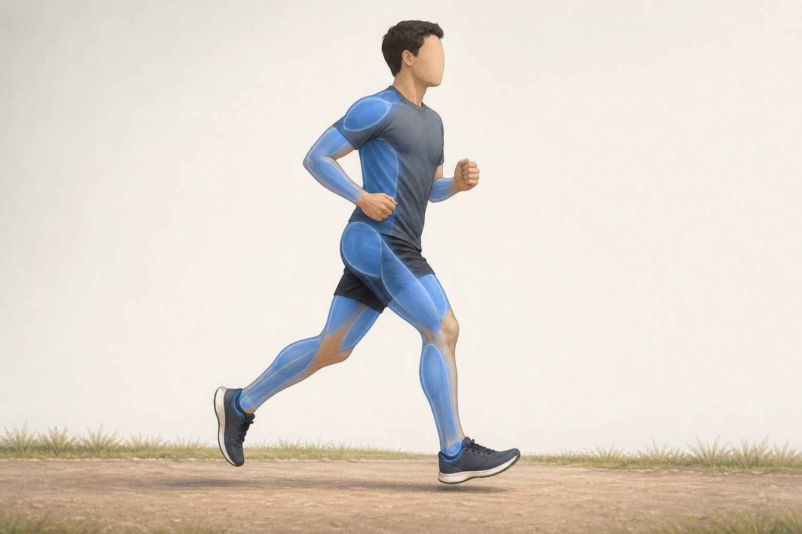
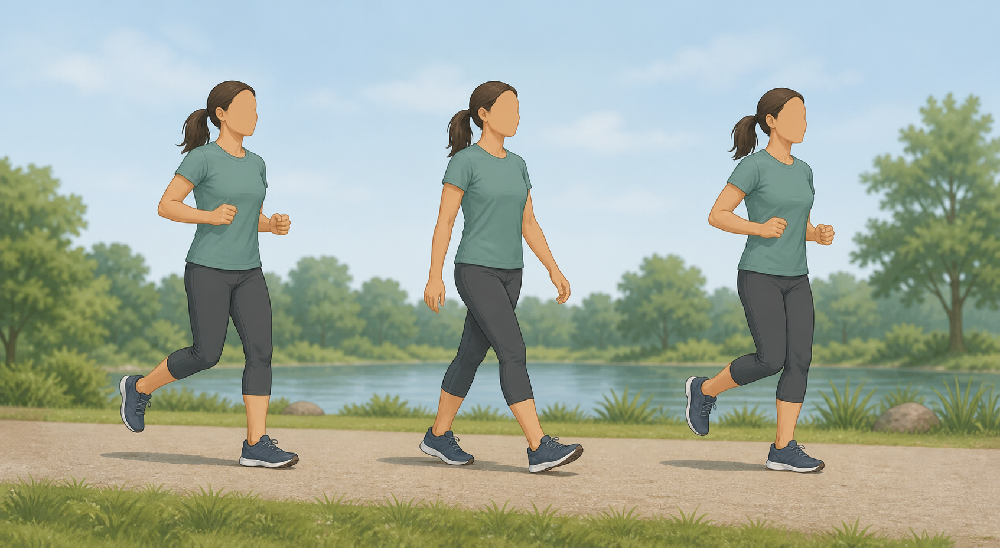
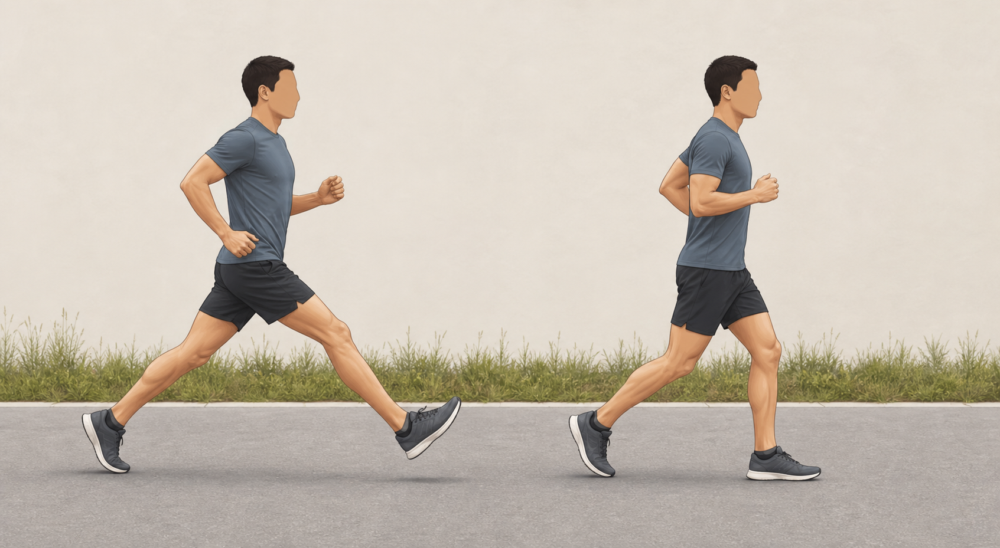

# Safer Running Basics

Author: GymPrimer contributors
Created: 2026-07-06
Last reviewed: 2026-07-06
Next review due: 2027-07-06
Review scope: beginner running education, source support, and safety boundary

> Disclaimer: GymPrimer is educational content for general exercise literacy.
> It is not medical advice and not personalized coaching.

Also searched as: injury-free running, beginner running, running without getting hurt

## What this is for

Use this page when you want to start running as a basic cardio activity. It is
for beginners who need a simple way to understand run/walk intervals, easy
effort, rest days, gradual loading, and relaxed running form.
[NHS][nhs-couch-to-5k] [Mayo Clinic Health System][mchs-better-runner]

This is an exercise-literacy page, not a race plan or individual coaching
program. The Markdown text is the source of truth for effort, progression,
muscles, and safety.

Use these images as broad visual references. The Markdown instructions below
remain the source of truth for effort, form, muscles, progression, and safety.

## What this page cannot promise

No page can guarantee injury-free running. This page teaches general
risk-reduction practices that may reduce common beginner mistakes, such as
doing too much too soon, skipping rest, and turning every run into a hard run.
[Mayo Clinic Health System][mchs-better-runner]

Strength and form guidance can support general running capacity and body
awareness, but GymPrimer does not claim that any single exercise or cue
prevents running injuries. Evidence reviews remain cautious about exercise-only
prevention programs and point to broader education, recovery, graduated
running, footwear, and support topics. [PubMed][pubmed-running-injury-exercise-prevention] [PMC][pmc-running-injury-support]

## Before you start

Choose a clear, visible route with a surface that feels even and manageable.
Start with easy effort before adding speed, hills, or extra running days.
[Mayo Clinic Health System][mchs-better-runner]

Adult activity guidance commonly includes aerobic activity plus
muscle-strengthening activity on at least two days per week. Running can be one
part of that broader activity picture; it does not replace all strength work.
[CDC][cdc-adult-activity]

## Warm up

Begin with 3-5 minutes of brisk walking or very easy jogging. The goal is to
raise effort gradually, not to rush into a hard first step.
[Mayo Clinic Health System][mchs-better-runner]

If the first few minutes feel rushed, keep walking longer before you add short
running intervals.

## Running form basics

Use simple cues instead of forcing a rigid style.

- Run tall without leaning back.
- Keep shoulders, jaw, and hands relaxed.
- Let the arms swing naturally beside the body.
- Keep steps short enough that the foot does not reach far in front of you.
- Land quietly and keep effort easy.
- Do not force a specific foot strike.

ACSM running-form guidance discusses reducing overreaching mechanics and
staying relaxed, but GymPrimer keeps those ideas as broad beginner education,
not formal gait retraining. [ACSM][acsm-running-form]

## Muscles involved

| Role | Muscle region | What it helps do |
|---|---|---|
| Support and push-off | Glutes, thighs, and calves | Help support each step and push the ground away. [Mayo Clinic Health System][mchs-better-runner] |
| Landing control | Feet, ankles, calves, and thighs | Help absorb and control each landing without treating one exact landing style as mandatory. [ACSM][acsm-running-form] |
| Posture and transfer | Trunk | Helps you stay tall while the legs move. [ACSM][acsm-running-form] |
| Rhythm and balance | Shoulders, upper back, and arms | Help arm swing stay relaxed and coordinated. [ACSM][acsm-running-form] |

Treat this as broad body-awareness guidance, not a test of exact muscle
activation.

## What you should feel

You should feel warm and slightly out of breath, but not panicked or strained.
At an easy beginner effort, you should be able to speak in short sentences.
[NHS][nhs-couch-to-5k]

Your legs and calves may feel like they are working. Your shoulders, hands,
jaw, and neck should stay relaxed.

Use the central [Red Flags](../RED-FLAGS.md) page and appropriate professional guidance for chest pain, dizziness, fainting, unusual shortness of breath, sharp pain, numbness, weakness, symptoms that worsen, persistent pain, or symptoms that do not settle. [Mayo Clinic][mayo-exercise-chronic-disease]

## How much to do

Method type: basic_cardio_activity

Beginner starting point: Try 10-20 minutes total. Alternate short easy running
with walking recovery. A simple starting structure is three running days per
week with a rest day between running days. [NHS][nhs-couch-to-5k]

Effort: Keep the running portions easy enough that you could speak in short
sentences. Walking breaks are part of the method, not a failure.
[NHS][nhs-couch-to-5k]

Progression: First make the same run/walk session feel smoother. Then add a
little more total time. Then add more running time within the same session.
Avoid adding distance, speed, hills, and extra running days all at once. Mayo
Clinic Health System advises new runners to avoid increasing mileage by more
than 10% per week. [Mayo Clinic Health System][mchs-better-runner]

Stop if: Stop the run for chest pain, dizziness, fainting, unusual shortness of breath, sharp pain, numbness, weakness, symptoms that worsen, or symptoms that do not settle; use the central [Red Flags](../RED-FLAGS.md) page when symptoms need more than exercise education. [Mayo Clinic][mayo-exercise-chronic-disease]

This method uses time, effort, rest, repeatability, progression, and back-off
rules. It is not a pace target or race schedule.

## Common mistakes

| Mistake | Safer framing |
|---|---|
| Running too far too soon | Use run/walk intervals and increase gradually. [Mayo Clinic Health System][mchs-better-runner] |
| Turning every run into a hard run | Keep most early running easy enough to talk in short sentences. [NHS][nhs-couch-to-5k] |
| Skipping rest days | Use rest days so the body has time to adapt. [NHS][nhs-couch-to-5k] |
| Overstriding | Keep steps short enough that the foot does not reach far in front of the body. [ACSM][acsm-running-form] |
| Tense shoulders and hands | Keep arms relaxed and rhythmical. [ACSM][acsm-running-form] |
| Ignoring sharp or worsening symptoms | Use the central [Red Flags](../RED-FLAGS.md) page when symptoms need more than exercise education. [Mayo Clinic][mayo-exercise-chronic-disease] |

## Easier version

Use shorter total time, more walking, flatter routes, and fewer running days.
For example, walk most of the session and add a few brief easy-running
intervals.

## Harder version

Make the same route and same easy effort feel repeatable before adding more
running time. Later, add a small amount of total time or running time while
keeping the session conversational.

Do not add hard intervals, hill-repeat programming, extra days, and faster
running in the same step.

## Safety notes

Start with run/walk intervals, keep early running easy, use rest days, and add
only one training variable at a time. [NHS][nhs-couch-to-5k] [Mayo Clinic Health System][mchs-better-runner]

Stop and seek appropriate help for chest pain, dizziness, fainting, unusual shortness of breath, sharp pain, numbness, weakness, symptoms that worsen, or symptoms that do not settle. Use [Red Flags](../RED-FLAGS.md) for the central safety route. [Mayo Clinic][mayo-exercise-chronic-disease]

Stop if the route, surface, weather, traffic, or visibility feels unsafe. Pick an easier route instead of forcing the run. [Mayo Clinic Health System][mchs-better-runner]

## Sources

- [NHS Couch to 5K running plan][nhs-couch-to-5k]
- [Mayo Clinic Health System running guidance][mchs-better-runner]
- [CDC adult activity guidance][cdc-adult-activity]
- [ACSM distance running form guidance][acsm-running-form]
- [Mayo Clinic exercise and chronic disease guidance][mayo-exercise-chronic-disease]
- [PubMed: exercise-based prevention programs and running-related injuries][pubmed-running-injury-exercise-prevention]
- [PMC: running-centred injury prevention support scoping review][pmc-running-injury-support]

[nhs-couch-to-5k]: https://www.nhs.uk/better-health/get-active/get-running-with-couch-to-5k/couch-to-5k-running-plan/
[mchs-better-runner]: https://www.mayoclinichealthsystem.org/hometown-health/speaking-of-health/how-can-i-become-a-better-runner-and-avoid-injury
[cdc-adult-activity]: https://www.cdc.gov/physical-activity-basics/guidelines/adults.html
[acsm-running-form]: https://acsm.org/distance-running-form-tips/
[mayo-exercise-chronic-disease]: https://www.mayoclinic.org/healthy-lifestyle/fitness/in-depth/exercise-and-chronic-disease/art-20046049
[pubmed-running-injury-exercise-prevention]: https://pubmed.ncbi.nlm.nih.gov/38261240/
[pmc-running-injury-support]: https://pmc.ncbi.nlm.nih.gov/articles/PMC11986186/
