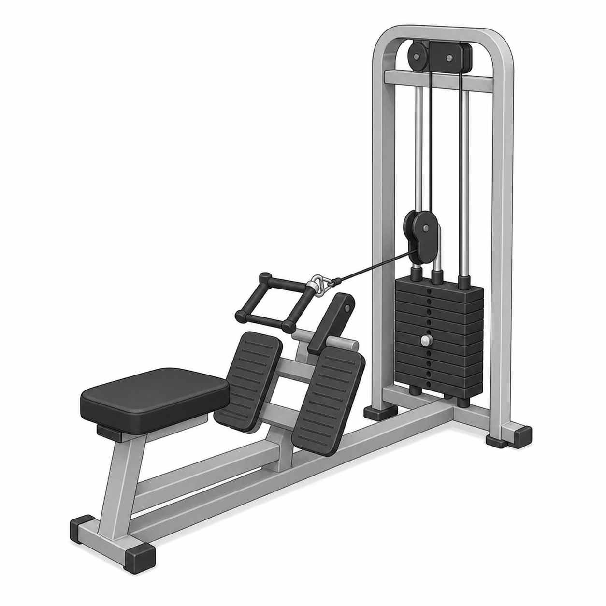
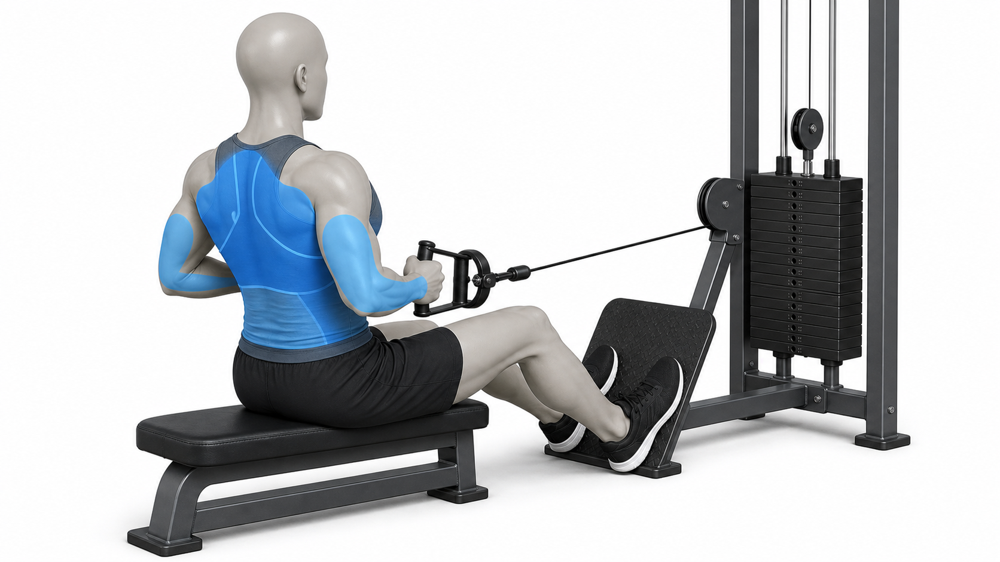

# Seated Row

Author: xiongxianfei
Created: 2026-06-30
Last reviewed: 2026-06-30
Next review due: 2027-06-30
Review scope: sources, scope boundary, comprehension

> Disclaimer: GymPrimer is educational content for general exercise literacy.
> It is not medical advice and not personalized coaching.

## What this exercise is for

The seated row is a machine pulling exercise. It helps beginners practice
pulling handles toward the torso while the seat, foot support, or chest pad
makes the setup easier to repeat.

Five beginner use cases:

- Learn a horizontal pulling pattern with a repeatable seated setup.
- Practice pulling without turning the movement into a full-body swing.
- Learn how foot support, chest support, or seat position changes setup.
- Pair with a pushing exercise such as the chest press for a simple upper-body
  session.
- Use a lighter load to practice a controlled return before adding weight.

## Equipment setup

Set the seat so you can hold the handles with your shoulders relaxed and your
torso steady. If the machine has a chest pad, adjust it so you can reach the
handles without rounding forward.

Use the image only to recognize the main parts of the machine. The exact handle
shape, pad style, and foot support can vary by gym.

## Muscles involved

| Role | Muscle region | What it helps do |
|---|---|---|
| Main driver | Upper back and lats | Help pull the handles toward your torso. [Source][local-seated-row-instruction] |
| Support | Arms and grip | Help hold the handles and finish the pull without taking over. [Source][local-seated-row-instruction] |
| Posture / transfer | Trunk | Helps keep the torso steady while the cable moves. [Source][local-seated-row-instruction] |

Use the muscle-attention image only as a broad region reference. The exact
muscle guidance stays in the table and source notes.

## Movement breakdown

### 1. Set up

Sit tall, place your feet on the supports, and start with your arms long.

### 2. Pull

Pull the handles toward your lower ribs. Keep your elbows moving back.

### 3. Pause

Pause briefly when the handles reach your torso and your shoulders still feel relaxed.

### 4. Return

Reach forward under control until your arms are long again. Controlled lifting
and lowering are part of proper weight-training technique.
[Mayo Clinic][mayo-weight-training]

## What you should feel

You may feel a steady pull across the upper back while the arms help finish the
movement. Pay attention to keeping the torso quiet; if your torso rocks to move
the handles, make the load lighter.

## Common mistakes

- Starting with shoulders shrugged.
- Yanking the handles with the lower body.
- Letting the return pull you out of position.
- Chasing range that makes the setup unstable.

## Easier version

Use a lighter load and reset your posture before each repetition.

## Harder version

Keep the same load and slow the return before adding more weight.

## Safety notes

Stop if sharp or unsafe. [Mayo Clinic][mayo-weight-training]

## Sources

- [Mayo Clinic weight training technique guidance][mayo-weight-training]
- [Mayo Clinic weight training setup reference][local-seated-row-setup]
- [Mayo Clinic weight training safety reference][local-seated-row-safety]
- [Seated cable row instruction and muscle reference][local-seated-row-instruction]

[mayo-weight-training]: https://www.mayoclinic.org/healthy-lifestyle/fitness/in-depth/weight-training/art-20045842
[local-seated-row-setup]: https://www.mayoclinic.org/healthy-lifestyle/fitness/in-depth/weight-training/art-20045842
[local-seated-row-safety]: https://www.mayoclinic.org/healthy-lifestyle/fitness/in-depth/weight-training/art-20045842
[local-seated-row-instruction]: https://www.muscleandstrength.com/exercises/seated-row.html
