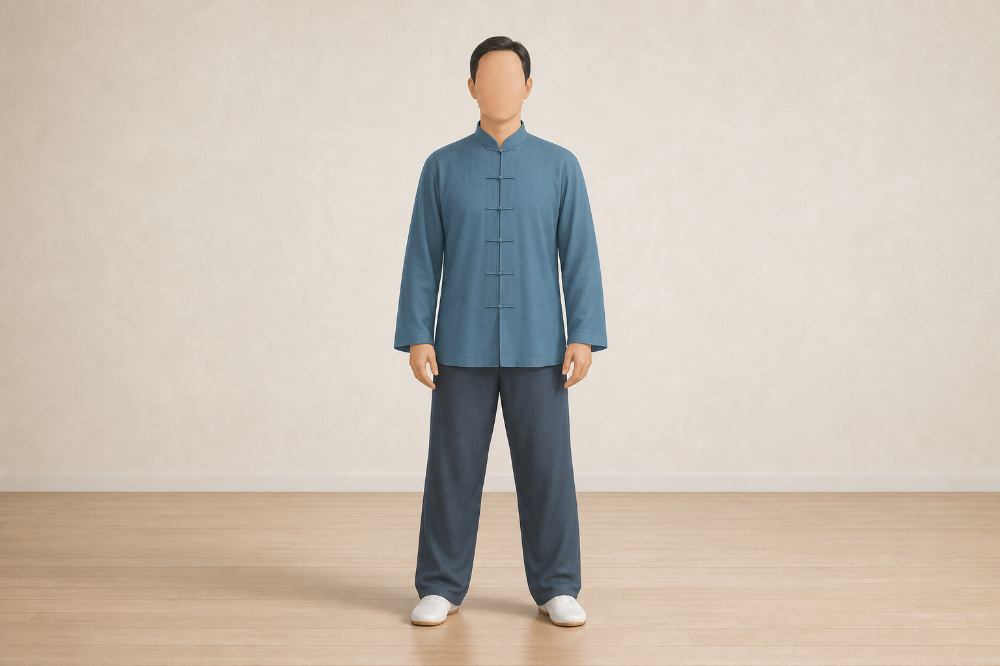
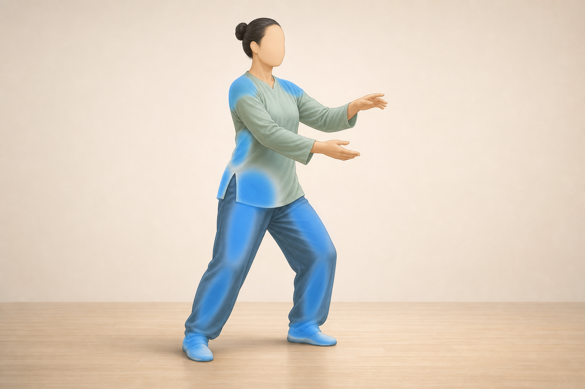
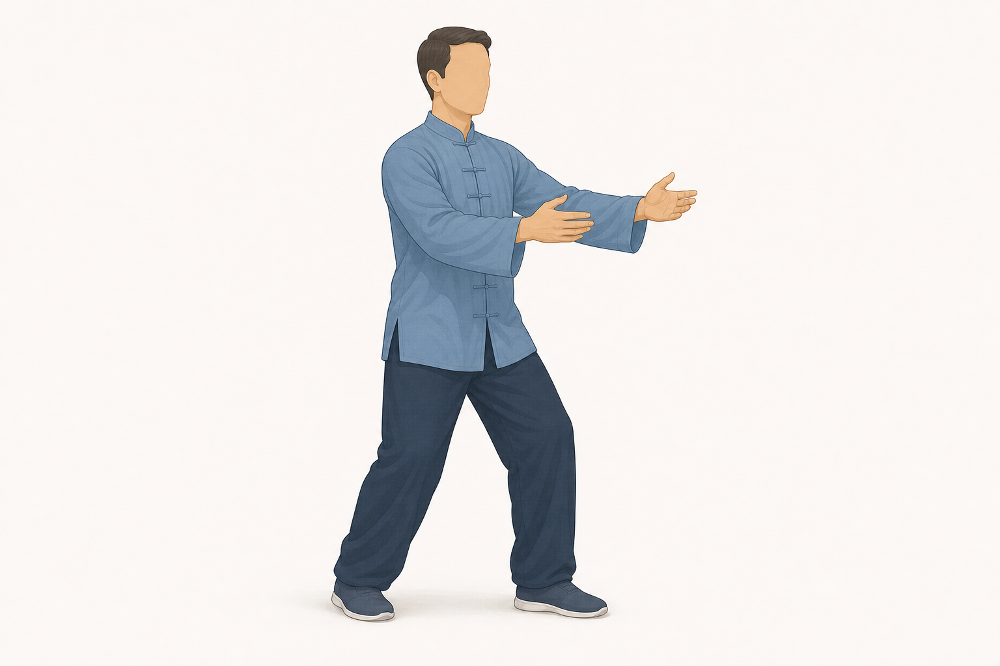
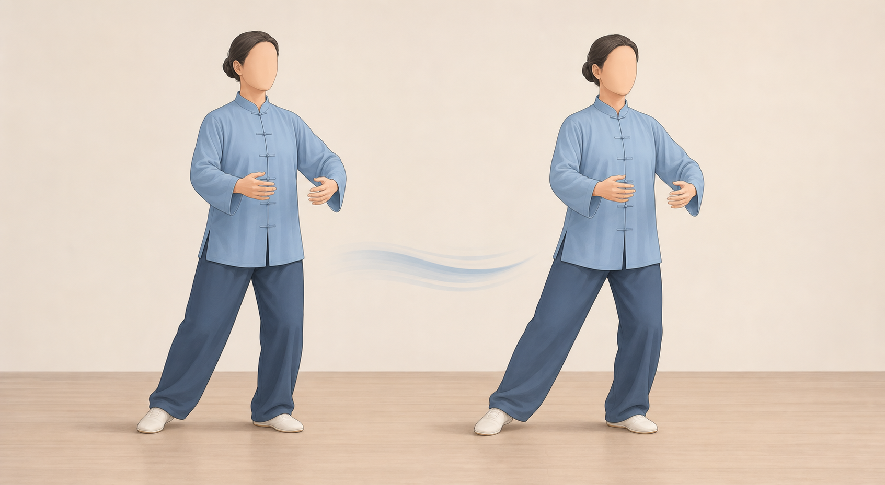
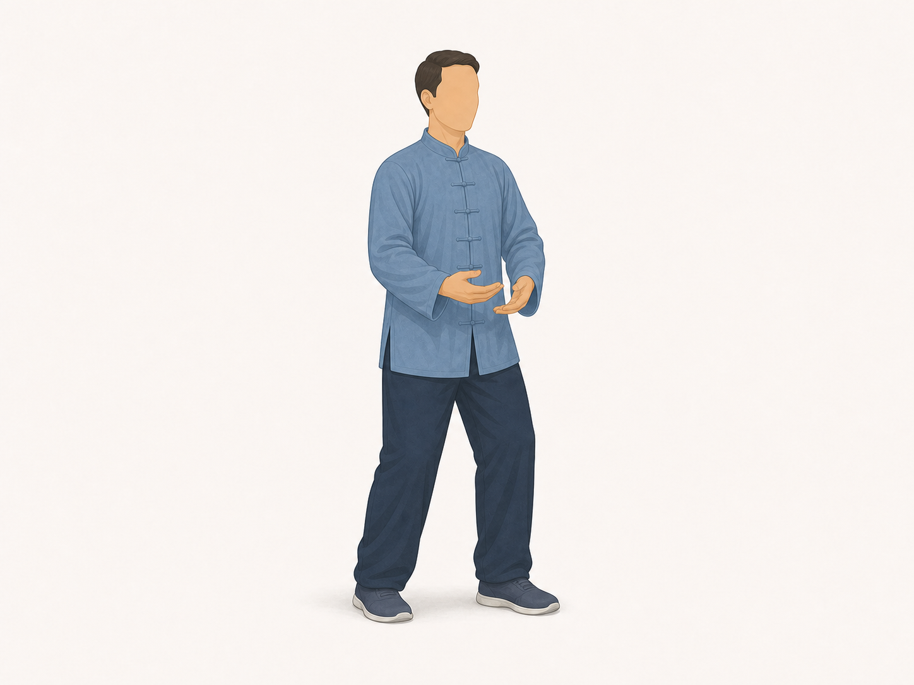

# Tai Chi Basics

Also known as: Tai Chi beginner basics

Author: xiongxianfei
Created: 2026-07-06
Last reviewed: 2026-07-06
Next review due: 2027-07-06
Review scope: sources, scope boundary, exercise contract

> Disclaimer: GymPrimer is educational content for general exercise literacy.
> It is not medical advice and not personalized coaching.

Safety routing: see [RED-FLAGS.md](../RED-FLAGS.md) for symptoms or professional-care situations where a static exercise page is the wrong tool.

## What this is for

Tai Chi Basics is low-impact mindful movement practice. Use it to practice slow movement, coordination, relaxed posture, breathing, and movement literacy. NCCIH describes tai chi as slow gentle movement with physical postures, a meditative state of mind, and controlled breathing. [NCCIH][nccih-tai-chi]

This page covers only a beginner-ready stance, a small weight shift, a simple opening movement, and a return to quiet standing. The written Markdown remains the source of truth for setup, muscles, method, and safety.

Use these images as broad visual references. Keep the written setup, movement, muscle, and safety notes as the source of truth.

## Before you start

Practice in comfortable clothing and use footwear or stable foot contact that does not slip. Choose a clear, flat surface, and keep a wall or stable chair nearby when balance is uncertain. Start with small, slow movements. Harvard Health recommends comfortable clothing and non-slip shoes with enough support for balance, and NHS balance-exercise guidance recommends building up slowly near a wall or stable chair when needed. [Harvard Health][harvard-tai-chi] [NHS][nhs-balance-exercises]

Ask a qualified instructor or clinician before using this page when a medical condition, medication, injury history, dizziness, or balance concern makes gentle standing practice uncertain. Harvard Health recommends checking with a medical care team when musculoskeletal limitations, medical conditions, or medications may make tai chi uncertain. [Harvard Health][harvard-tai-chi]

## Setup

Stand tall on a clear, flat surface. Place the feet about hip-width to shoulder-width apart, or slightly narrower if that feels steadier. Keep the knees soft instead of locked, the trunk upright, the shoulders relaxed, and the arms resting naturally.

Keep the first version small. Let the feet feel connected to the floor, breathe normally, and stay close enough to a wall or stable chair to pause or steady the body if needed. [NHS][nhs-balance-exercises]

## Muscles involved

| Role | Muscle region | What it helps do |
|---|---|---|
| Support and weight shift | Legs and glutes | Help move weight from one foot to the other. [Harvard Health][harvard-tai-chi] |
| Posture and balance | Trunk | Helps keep the body tall and steady while the legs shift. [Harvard Health][harvard-tai-chi] |
| Relaxed arm motion | Shoulders and upper back | Help the arms move smoothly without shrugging. [Harvard Health][harvard-tai-chi] |
| Foot control | Feet and ankles | Help sense the ground and make small balance adjustments. [NHS][nhs-balance-exercises] |

Treat this as broad body-awareness guidance, not a test of exact muscle effort.

## Movement breakdown

### 1. Ready stance

Stand in the setup position. Let the knees stay soft, the shoulders settle, and the breath stay quiet. [NCCIH][nccih-tai-chi]

### 2. Weight shift

Slowly move a little more weight into one foot. Let the other foot become lighter without lifting it high or leaning the trunk. Return toward center, then repeat to the other side. VA describes Tai Chi as using slow, flowing movements, and notes that simple motions may include shifting weight. [VA][va-tai-chi-qigong]

### 3. Opening movement

Let the arms float forward only as far as the shoulders stay relaxed. Lower the arms slowly while the feet stay grounded and the trunk stays upright. Keep the movement smaller and slower before making it larger. [Harvard Health][harvard-tai-chi]

### 4. Return to quiet standing

Finish by standing still, breathing normally, and letting the arms rest naturally. Pause before starting another round.

## What you should feel

You may feel quiet work in the legs and glutes as weight moves from side to side. Pay attention to a tall trunk, relaxed shoulders, steady feet, and breathing that stays normal.

Try to keep the movement smooth enough that the arms feel light and the knees do not move into a deep bend.

## Common mistakes

- Locking the knees at the start.
- Making the weight shift so large that the trunk leans or the feet grip hard.
- Raising the arms until the shoulders shrug.
- Moving quickly instead of slowly enough to notice balance and breathing.
- Turning the first version into deep knee bends or a long sequence.

## How much to do

Method type: low_load_control_drill

Beginner starting point: Practice for 3-5 minutes as static general education, using small slow movement and normal breathing. [NCCIH][nccih-tai-chi] [Harvard Health][harvard-tai-chi]
Effort: Keep the effort easy enough that posture, breathing, and balance stay calm.
Rest: Pause in quiet standing as needed between short practice rounds.
Progression: First make the movement smoother. Then practice for a little longer. Do not make the movement bigger, deeper, faster, or more complex just to make it harder. [Harvard Health][harvard-tai-chi] [NHS][nhs-balance-exercises]
Stop if: Stop if balance, posture, or breathing no longer feels controlled. Stop for dizziness, chest pain, fainting, unusual shortness of breath, sharp pain, worsening symptoms, loss of balance control, or uncertainty caused by medical condition, medication, injury history, or balance concerns. Use the central [Red Flags](../RED-FLAGS.md) page when symptoms need more than exercise education. [Mayo Clinic][local-tai-chi-basics-red-flags] [Harvard Health][harvard-tai-chi]

These are general starter labels for a low-load control drill, not a personal schedule.

## Easier version

Make the weight shift smaller. Keep both feet fully on the floor and stay close to a wall or stable chair. Seated Tai Chi or instructor-guided options may be more appropriate when standing practice is uncertain. [VA][va-tai-chi-qigong]

## Harder version

Use the same small pattern for a little longer while keeping the knees soft, the trunk upright, the shoulders relaxed, and the breathing normal. Add smoothness before size, speed, depth, or more movements.

## Safety notes

Stop and seek appropriate help for chest pain, fainting, severe dizziness, unusual shortness of breath, sharp pain, worsening symptoms, loss of balance control, or any feeling that the movement is unsafe. Use [Red Flags](../RED-FLAGS.md) for the central safety route. [Mayo Clinic][local-tai-chi-basics-red-flags]

Use a wall or stable chair if balance is uncertain. Keep the first version small and avoid deep knee bends. Ask a qualified instructor or clinician when a medical condition, medication, injury history, dizziness, or balance concern makes practice uncertain. [Harvard Health][harvard-tai-chi] [NHS][nhs-balance-exercises]

## Sources

- [NCCIH - Tai Chi: What You Need To Know][nccih-tai-chi]
- [Harvard Health - The health benefits of tai chi][harvard-tai-chi]
- [Veterans Affairs Whole Health - Tai Chi and Qigong][va-tai-chi-qigong]
- [NHS - Balance exercises][nhs-balance-exercises]
- [Mayo Clinic heart attack symptoms reference][local-tai-chi-basics-red-flags]

[nccih-tai-chi]: https://www.nccih.nih.gov/health/tai-chi-what-you-need-to-know
[harvard-tai-chi]: https://www.health.harvard.edu/exercise-and-fitness/the-health-benefits-of-tai-chi
[va-tai-chi-qigong]: https://www.va.gov/WHOLEHEALTH/cih/Tai_Chi_and_Qigong.asp
[nhs-balance-exercises]: https://www.nhs.uk/live-well/exercise/balance-exercises/
[local-tai-chi-basics-red-flags]: https://www.mayoclinic.org/diseases-conditions/heart-attack/in-depth/heart-attack-symptoms/art-20047744
