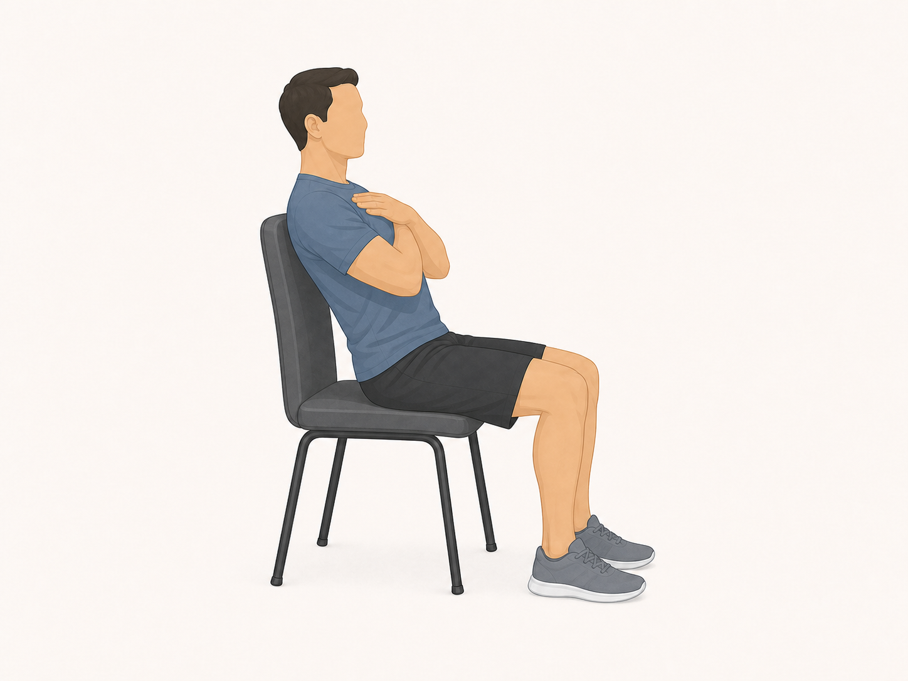
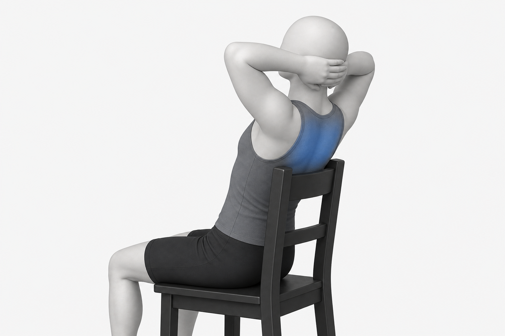
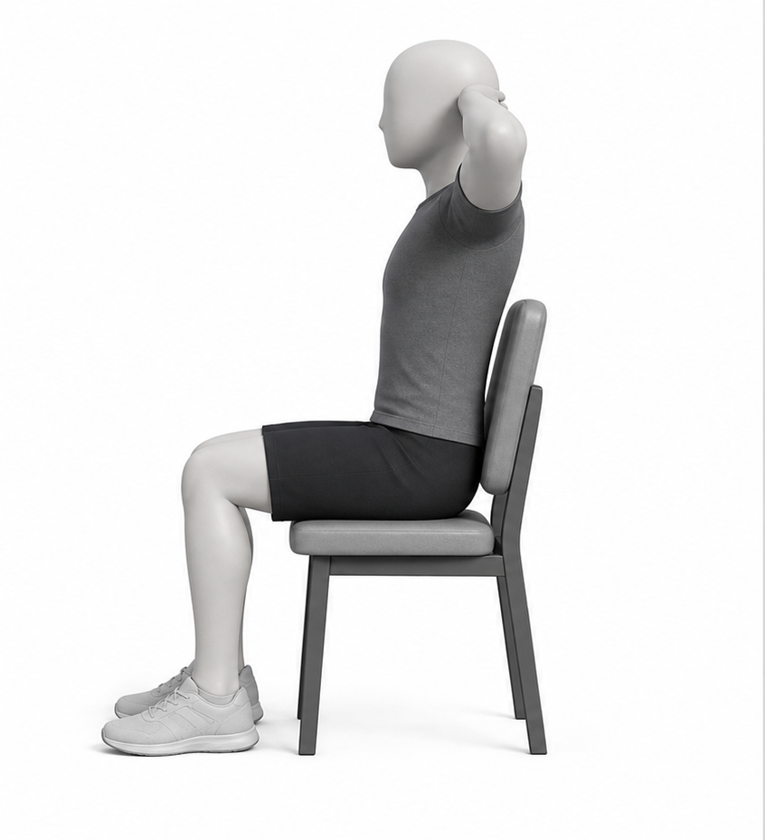
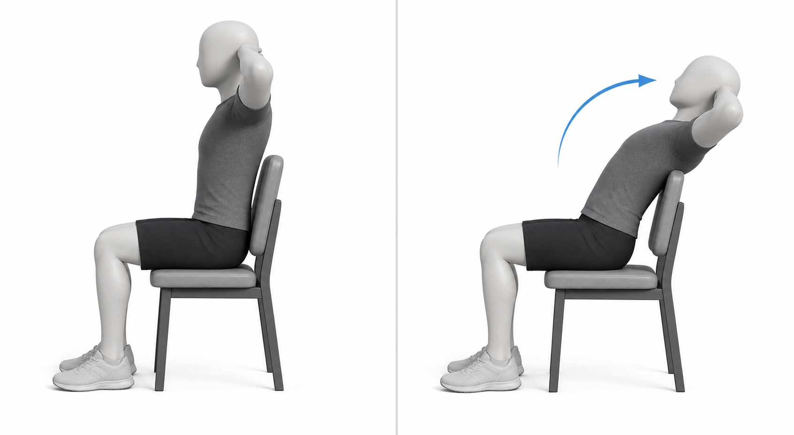
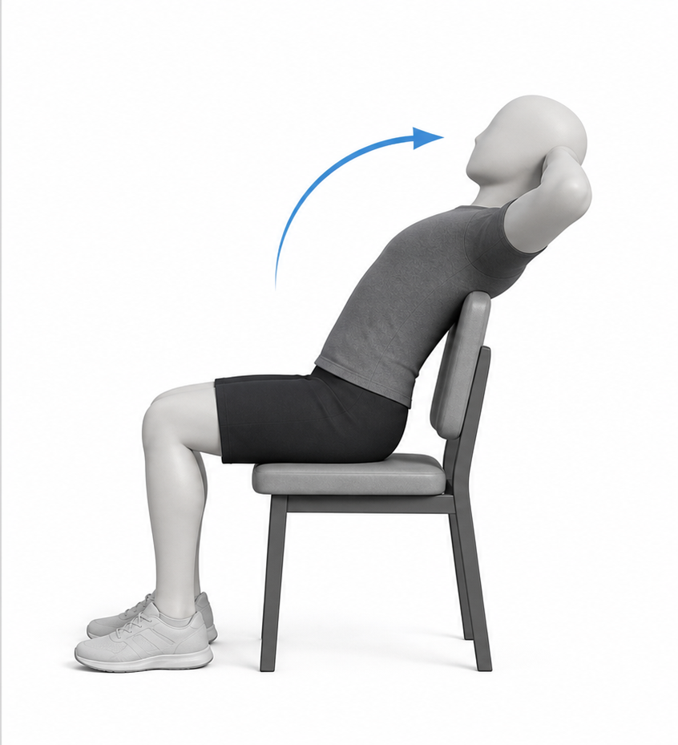

# Thoracic Extension

Also known as: upper-back extension, chair thoracic extension

Author: xiongxianfei
Created: 2026-06-30
Last reviewed: 2026-06-30
Next review due: 2027-06-30
Review scope: sources, scope boundary, exercise contract

Safety routing: see [RED-FLAGS.md](../RED-FLAGS.md) for symptoms or professional-care situations where a static exercise page is the wrong tool.

## What this exercise is for

Thoracic extension is a simple upper-back mobility drill. It gives beginners a way to practice moving the rib cage and upper back without treating posture as a condition or promising a correction. General strength guidance favors controlled movement and manageable effort. [Mayo Clinic][mayo-weight-training]

## Equipment setup

Use a sturdy chair with a back rest. Sit upright, slide the hips back in the chair, and keep the feet on the floor. [Source][local-thoracic-extension-instruction]

## Muscles involved

- **Mobility focus:** the upper back, or thoracic region, is the area being moved gently over the chair. [Source][local-thoracic-extension-instruction]
- **Support:** the trunk and neck stay quiet enough that the drill does not turn into low-back arching or neck forcing. [Source][local-thoracic-extension-instruction]

Treat the muscle wording as a movement cue, not a claim that the drill changes posture.

Use the image as a broad attention-region reference. Keep the muscle wording and citations in the Markdown text above.

## Movement breakdown

Use the image as a simple movement reference. Keep following the written setup and safety notes.

### 1. Set up

Sit upright in the chair and place the hands behind the head or neck. [Source][local-thoracic-extension-instruction]

### 2. Move

Gently lean the upper back over the top of the chair. [Source][local-thoracic-extension-instruction]

### 3. Pause

Pause briefly if the position still feels controlled. [Source][local-thoracic-extension-instruction]

### 4. Return

Return to the upright starting position with control. [Source][local-thoracic-extension-instruction]

## What you should feel

You may feel light movement or stretch through the upper back. Pay attention to a gentle upper-back motion rather than forcing the neck backward or arching the low back. [Source][local-thoracic-extension-instruction]

## Common mistakes

- Using a chair or support that feels unstable.
- Forcing the head or neck backward instead of moving gently over the chair. [Source][local-thoracic-extension-instruction]

## Easier version

Use a smaller range and a shorter pause.

## Harder version

Pause briefly before returning. Keep this as a mobility option, not a required routine. [ACSM][acsm-resistance-training]

## How much to do

Method type: mobility_drill

For the terms in this section, see [Sets, Reps, Holds, Rest, and Progression](../principles/sets-reps-holds-rest-and-progression.md).

Beginner starting point: Try 1-2 sets of 6-10 slow reps; rest 30-60 seconds. [Source][local-thoracic-extension-instruction]
Effort: Use an easy range that feels controlled through the upper back. [Source][local-thoracic-extension-instruction]
Rest: Rest long enough that the next rep stays gentle and unforced. [Source][local-thoracic-extension-instruction]
Progression: Progress by smoother control or a brief comfortable pause, not by forcing the end range. [ACSM][acsm-resistance-training]
Stop if: Stop the set when the neck is forced backward, the chair feels unstable, or the position feels sharp, worsening, unusual, or unsafe. [NHS][nhs-neck-pain]

## Safety notes

Stop if the position feels sharp, worsening, unusual, or unsafe. A static exercise page cannot decide whether symptoms are safe to train through; use the red-flags reference and professional care when needed. [NHS][nhs-neck-pain]

## Sources

- [Mayo Clinic - Weight training technique guidance][mayo-weight-training]
- [Mayo Clinic - Posture and body alignment Q&A][mayo-posture-body-alignment]
- [Physitrack - Thoracic extension over chair][local-thoracic-extension-instruction]
- [AAOS - Shoulder impingement and rotator cuff tendinitis][aaos-shoulder-impingement-rotator-cuff-tendinitis]
- [NHS - Neck pain and stiff neck][nhs-neck-pain]
- [ACSM - Resistance training guidance][acsm-resistance-training]

[mayo-weight-training]: https://www.mayoclinic.org/healthy-lifestyle/fitness/in-depth/weight-training/art-20045842
[mayo-posture-body-alignment]: https://newsnetwork.mayoclinic.org/discussion/mayo-clinic-q-and-a-proper-posture-and-body-alignment/
[local-thoracic-extension-instruction]: https://us.physitrack.com/home-exercise-video/thoracic-extension-over-chair
[aaos-shoulder-impingement-rotator-cuff-tendinitis]: https://orthoinfo.aaos.org/en/diseases--conditions/shoulder-impingementrotator-cuff-tendinitis/
[nhs-neck-pain]: https://www.nhs.uk/conditions/neck-pain-and-stiff-neck/
[acsm-resistance-training]: https://acsm.org/resistance-training-guidelines-update-2026/
