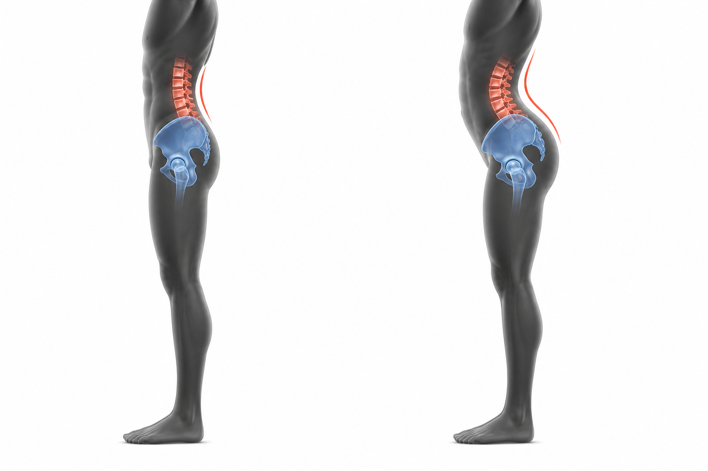

# Anterior Pelvic Tilt

Author: xiongxianfei
Created: 2026-06-29
Last reviewed: 2026-06-29
Next review due: 2026-09-27
Review scope: sources, red flags, scope boundary, comprehension

## What this page is

This page explains anterior pelvic tilt (APT) as an observable pelvis-and-spine pattern: in a side view, the front bony points of the pelvis sit lower than the back bony points, and the low back often looks more arched than a neutral standing position. Everyone has some pelvic tilt; the useful question is not whether tilt exists but whether the amount, control, comfort, and training context matter for the person reading this page. [Herrington 2011][pubmed-herrington-pelvic-tilt]

This page is written by an engineer who reads, not a clinician. Check the cited sources and use a qualified professional for individual assessment.

## What this page is not

This page does not diagnose the reader, prove that a posture is harmful, or provide individualized care. It does not promise to correct a pelvis position or explain all low back pain.

## Red flags: when to stop reading and seek care

Stop using this page as a self-education guide and seek appropriate care if back or leg symptoms include any item below. [Mayo Clinic][mayo-back-pain-when-to-see-doctor] [MedlinePlus][medlineplus-low-back-pain-acute]

- follow a crash, fall, or sports injury
- include new bowel or bladder control problems
- include fever
- spread below the knee
- include weakness, numbness, or tingling in one or both legs
- wake the reader at night
- make balance or walking difficult

Read [the full red-flags reference](../RED-FLAGS.md) before using any GymPrimer page to think about pain or training decisions.

## Why beginners come to this page

Beginners usually land here because they notice one of four things:

- the belly seems to push forward or the low back seems to arch a lot when standing
- a coach, trainer, or social-media video said their posture is "off"
- the low back feels stiff or achy and someone named APT as the possible reason
- squats, hinges, bridges, or planks feel like they turn into low-back arching

## Working definition

Anterior pelvic tilt means the pelvis is tipped forward in the sagittal plane. A practical landmark model is ASIS to PSIS: the front bony points near the hip crease, called the anterior superior iliac spines, sit lower than the rear bony points, called the posterior superior iliac spines. That forward pelvic angle usually pairs with a more visible inward curve in the low back.

Neutral alignment is not a perfectly flat back. A normal spine has curves, and many asymptomatic people stand with some anterior pelvic tilt. In one asymptomatic sample, most participants measured with anterior tilt, which is a useful reminder that visible tilt is common and not automatically a problem. [Herrington 2011][pubmed-herrington-pelvic-tilt]

Beginners often meet APT through Janda's lower-crossed-syndrome model: hip flexors and low-back extensors described as relatively short or overactive, abdominals and glutes described as relatively weak or underused. Treat that model as a simple observation framework, not as proof that a visible posture causes pain. [NASM][local-anterior-pelvic-tilt-nasm] [Lederman 2011][pubmed-lederman-psb-model]

## How to notice this in yourself

These are observations, not diagnoses.

- **Side-view photo:** take a relaxed side-view photo and compare the rib cage, belt line, pelvis, and low-back curve to a neutral standing reference.
- **Wall-stand check:** stand with the head, shoulder blades, and buttocks against a wall, heels a few inches forward, then notice how much space is behind the low back. Mayo Clinic uses this kind of wall test as a posture-awareness check, not as a diagnosis. [Mayo Clinic][mayo-posture-body-alignment]
- **ASIS-to-PSIS comparison:** with clean hands and no pain pressure, locate the front and back pelvic landmarks and notice whether the front point sits lower than the back point. Clinicians use more reliable tools when the degree of pelvic tilt actually matters. [Herrington 2011][pubmed-herrington-pelvic-tilt]

## The core reason

Mainstream educational and professional sources discuss APT through a few movement contributors. Treat these as descriptive contributors, not as a single cause.

**Hip-flexor stiffness or tone.** The iliopsoas and rectus femoris are the main hip flexors crossing the front of the hip; rectus femoris also crosses the knee. When these muscles are stiff or held in shortened positions for long stretches, they may make it harder to find or control a more neutral pelvis position. [NASM][local-anterior-pelvic-tilt-nasm]

**Reduced hip-extensor capacity.** The gluteus maximus and hamstrings extend the hip. When they are weak, hard to recruit, or poorly coordinated relative to the hip flexors and lumbar extensors, the pelvis has fewer active options for moving out of a forward-tilted position. [NASM][local-anterior-pelvic-tilt-nasm]

**Trunk-control patterns.** Trunk control here is not about sucking the stomach in. It is about keeping the ribs, pelvis, and breath organized while the arms or legs move. A beginner who cannot stabilize the rib-cage and pelvis relationship during simple movement often loads the lumbar extensors more than intended. Mayo Clinic's back-pain guidance also emphasizes flexibility, back and abdominal strength, posture, and movement modification with a physical therapist when pain is involved. [Mayo Clinic][local-anterior-pelvic-tilt-mayo-back-pain-treatment]

**Daily-position load.** Prolonged sitting, frequent end-range arching, sleeping habits, and footwear choices can shape the positions a body finds familiar. This is a contributor sources commonly mention, but it should not be presented as a single cause. [Physiopedia][local-anterior-pelvic-tilt-physiopedia]

## What is uncertain or mixed

The posture-pain link is contested. Lederman's critique of the postural-structural-biomechanical model argues that posture and structural variation are often overused as explanations for low back pain. That does not mean posture is irrelevant; it means posture is rarely enough by itself to explain a person's pain, function, or training choices. [Lederman 2011][pubmed-lederman-psb-model]

Descriptive pelvic-tilt research also argues for caution. Herrington's asymptomatic sample found anterior pelvic tilt to be common, so a visible anterior tilt cannot be treated as automatic evidence of pathology. [Herrington 2011][pubmed-herrington-pelvic-tilt]

Interventions for posture patterns are mixed because the target is not one thing. A person might need more hip-extension range, better trunk control, different lifting technique, more general strength, less fear around posture, or no change at all. Some clinicians still use the lower-crossed-syndrome model because it gives a concrete observation framework. The evidence-backed version is humbler: use the model to notice movement options, not to label a body as broken.

## What commonly helps

Read this as a menu of education options that a coach or clinician may select from, not as a routine or a personal prescription. The pattern journey is:

> user's pain point -> observable pattern -> likely movement contributors -> exercises that train the missing options

### 0. Reduce posture anxiety

Anterior pelvic tilt is common, often asymptomatic, and not automatically a problem. The evidence linking posture to pain is mixed. Approach the rest of this section as movement education, not as a flaw repair project.

### 1. Clear red flags first

If any of the red flags above apply, stop here and read [the red-flags reference](../RED-FLAGS.md). Exercise content is not the right next step when safety flags are present. [Mayo Clinic][mayo-back-pain-when-to-see-doctor] [MedlinePlus][medlineplus-low-back-pain-acute]

### 2. Learn pelvis control before loading it

Short motor-learning drills can help the reader feel pelvis movement without diagnosing posture.

- **Pelvic clock:** small anterior and posterior tilts while lying on the back, used to learn the available range of pelvic motion.
- **Anterior-to-posterior tilt practice:** moving between end ranges so neutral feels like a middle area, not a target to hold rigidly.
- **Relaxed middle breathing:** breathing in the middle position so it feels like an available default rather than a clenched shape.

These drills are short practices, not full exercise pages yet.

### 3. Strengthen trunk control

These exercises train the rib-cage and pelvis relationship without forcing the low back flat.

- **[Dead bug](../exercises/dead-bug.md)**
  - *Fix reason:* trains anti-extension control while the arms and legs move.
  - *Used muscles:* rectus abdominis, obliques, and transverse abdominis primary; hip flexors secondary in a controlled range.
  - *Important note:* shorten the arm or leg reach if the low back lifts away from the floor.
- **[Plank](../exercises/plank.md)**
  - *Fix reason:* trains whole-body trunk stiffness without hanging on the low-back arch.
  - *Used muscles:* rectus abdominis, obliques, transverse abdominis, glutes, and shoulders.
  - *Important note:* keep ribs down and glutes lightly engaged; sagging at the hips reinforces the same arching strategy.
- **[Bird dog](../exercises/bird-dog.md)**
  - *Fix reason:* trains trunk stability while hip extension and shoulder flexion happen together.
  - *Used muscles:* gluteus maximus, lumbar extensors, deep trunk muscles, shoulders, and hamstrings.
  - *Important note:* move slowly and keep the pelvis level instead of letting one hip drop or hike.

### 4. Strengthen hip extensors

These exercises build glute and hamstring capacity so hip extension does not have to come mainly from low-back arching.

- **[Glute bridge](../exercises/glute-bridge.md)**
  - *Fix reason:* trains hip extension with low spinal load.
  - *Used muscles:* gluteus maximus primary; hamstrings and trunk muscles secondary.
  - *Important note:* finish by squeezing the glutes, not by driving the ribs up and over-arching the low back.
- **[Hip hinge](../exercises/hip-hinge.md)**
  - *Fix reason:* teaches bending from the hips while keeping the ribs and pelvis organized.
  - *Used muscles:* hamstrings and gluteus maximus primary; spinal erectors and trunk muscles secondary.
  - *Important note:* stop the descent before the low back rounds or over-arches. [Mayo Clinic][mayo-weight-training]

### 5. Use hip-flexor mobility as an option, not proof

Stretching can be useful for some people, but a stretch helping does not prove that tight hip flexors caused the pattern.

- **[Kneeling hip-flexor stretch](../exercises/kneeling-hip-flexor-stretch.md)**
  - *Fix reason:* gives the iliopsoas and rectus femoris a simple stretch option while practicing pelvis position.
  - *Used muscles:* stretches iliopsoas and rectus femoris on the rear leg; lightly uses glutes and trunk muscles for position.
  - *Important note:* gently squeeze the rear glute and tuck the pelvis before moving forward; leaning back moves the stretch into the low back.

### 6. Train the body consistently, not specially

APT usually should not become a special condition routine. It should connect to normal beginner training: a leg pattern, a hinge pattern, a push, a pull, trunk control, and walking or low-intensity cardio across the week. See [How Many Days a Week Should I Train?](../principles/how-many-days-a-week.md) for the weekly frame.

## What to avoid

Avoid 30-day promises, posture-shaming, and language that treats anterior pelvic tilt as a flaw. Avoid forcing a tucked or flattened pelvis during every lift; the goal is movement options and control, not one correct posture. Avoid copying generic posture routines when pain, nerve symptoms, medical history, or major movement limits change the situation. Avoid attributing all back pain to pelvic tilt. Avoid turning the exercise menu above into a daily checklist without a reason.

## When to see a professional

See a physical therapist when symptoms persist, normal activity is limited, training repeatedly flares symptoms, or the question is return to activity after an injury. A physical therapist can assess movement, symptoms, and exercise tolerance in person. [Mayo Clinic][local-anterior-pelvic-tilt-mayo-back-pain-treatment]

See a GP or other medical clinician when pain comes with the red flags above, symptoms are not improving over weeks, neurological signs appear, or non-training health concerns are present. [Mayo Clinic][mayo-back-pain-when-to-see-doctor] [MedlinePlus][medlineplus-low-back-pain-acute]

Use a qualified strength coach for technique, exercise selection, and performance questions when there is no pain, medical context, or symptom uncertainty. A coach can help with squats, hinges, bracing, and load selection, but a coach should not diagnose pain.

## Where to next in this primer

- [Beginner Training Principles](../principles/beginner-training-principles.md) for the basic training frame.
- [How Many Days a Week Should I Train?](../principles/how-many-days-a-week.md) for weekly consistency.
- [Glute bridge](../exercises/glute-bridge.md) for the hip-extension side of the menu.
- [Dead bug](../exercises/dead-bug.md) for the trunk-control side of the menu.
- [Kneeling hip-flexor stretch](../exercises/kneeling-hip-flexor-stretch.md) for the mobility side of the menu.

## Sources

- [Mayo Clinic - Back pain: when to see a doctor][mayo-back-pain-when-to-see-doctor]
- [MedlinePlus - Acute low back pain][medlineplus-low-back-pain-acute]
- [Mayo Clinic Q&A - Proper posture and body alignment][mayo-posture-body-alignment]
- [Mayo Clinic - Weight training technique guidance][mayo-weight-training]
- [Mayo Clinic - Back pain diagnosis and treatment][local-anterior-pelvic-tilt-mayo-back-pain-treatment]
- [PubMed - Lederman 2011 postural-structural-biomechanical model][pubmed-lederman-psb-model]
- [PubMed - Herrington 2011 pelvic tilt in asymptomatic population][pubmed-herrington-pelvic-tilt]
- [NASM - Anterior pelvic tilt overview][local-anterior-pelvic-tilt-nasm]
- [Physiopedia - Anterior pelvic tilt][local-anterior-pelvic-tilt-physiopedia]

[mayo-back-pain-when-to-see-doctor]: https://www.mayoclinic.org/symptoms/back-pain/basics/when-to-see-doctor/sym-20050878
[medlineplus-low-back-pain-acute]: https://medlineplus.gov/ency/article/007425.htm
[mayo-posture-body-alignment]: https://newsnetwork.mayoclinic.org/discussion/mayo-clinic-q-and-a-proper-posture-and-body-alignment/
[mayo-weight-training]: https://www.mayoclinic.org/healthy-lifestyle/fitness/in-depth/weight-training/art-20045842
[local-anterior-pelvic-tilt-mayo-back-pain-treatment]: https://www.mayoclinic.org/diseases-conditions/back-pain/diagnosis-treatment/drc-20369911
[pubmed-lederman-psb-model]: https://pubmed.ncbi.nlm.nih.gov/21419349/
[pubmed-herrington-pelvic-tilt]: https://pubmed.ncbi.nlm.nih.gov/21658988/
[local-anterior-pelvic-tilt-nasm]: https://blog.nasm.org/what-is-anterior-pelvic-tilt-and-how-do-you-fix-it
[local-anterior-pelvic-tilt-physiopedia]: https://www.physio-pedia.com/Anterior_Pelvic_Tilt

## Author and review date

xiongxianfei, engineer who reads, not a clinician, 2026-06-29
