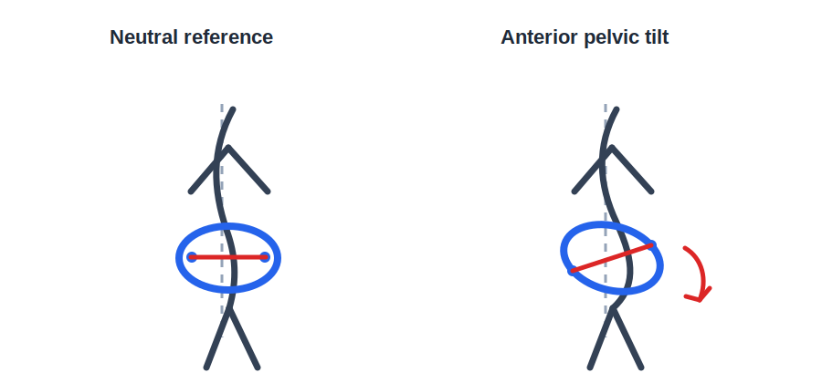

# Anterior Pelvic Tilt

Author: xiongxianfei
Created: 2026-06-29
Last reviewed: 2026-06-29
Next review due: 2026-09-27
Review scope: sources, red flags, scope boundary, comprehension

## What this page is

This page explains anterior pelvic tilt as an observable pelvis-and-spine pattern. In a side view, the front points of the pelvis sit lower than the back points, and the low back often looks more arched than a neutral standing position. [Herrington 2011][pubmed-herrington-pelvic-tilt]

Everyone has some pelvic tilt. The useful question is not whether tilt exists, but whether the amount, control, comfort, and training context matter for the person in front of a coach or clinician. This page is written by an engineer who reads, not a clinician; check the cited sources and use a qualified professional for individual assessment.

## What this page is not

This page does not diagnose the reader, prove that a posture is harmful, or provide individualized care. It does not promise to correct a pelvis position or explain all low back pain.

## Red flags: when to stop reading and seek care

Stop using this page as a self-education guide and seek appropriate care if back or leg symptoms follow a crash, fall, or sports injury; include new bowel or bladder control problems; include fever; spread below the knee; include weakness, numbness, or tingling in one or both legs; wake the reader at night; or make balance and walking difficult. [Mayo Clinic][mayo-back-pain-when-to-see-doctor] [MedlinePlus][medlineplus-low-back-pain-acute]

Read [the full red-flags reference](../about/red-flags.md) before using any GymPrimer page to think about pain or training decisions.

## Plain-language overview

Anterior pelvic tilt means the pelvis is tipped forward in the sagittal plane. A practical landmark model is ASIS to PSIS: the front bony points near the hip crease, called the anterior superior iliac spines, sit lower than the rear bony points, called the posterior superior iliac spines. That forward pelvic angle usually pairs with a more visible inward curve in the low back.

Neutral alignment is not a perfectly flat back. A normal spine has curves, and many asymptomatic people stand with some anterior pelvic tilt. In one asymptomatic sample, most participants measured with an anterior tilt, which is a useful reminder that visible tilt is common and not automatically a problem. [Herrington 2011][pubmed-herrington-pelvic-tilt]

Beginners often meet anterior pelvic tilt through Janda's lower-crossed-syndrome model: hip flexors and low-back extensors are described as relatively short or overactive, while abdominals and glutes are described as relatively weak or underused. Treat that model as a simple description that can guide observation, not as proof that a visible posture causes pain. [NASM][local-anterior-pelvic-tilt-nasm] [Lederman 2011][pubmed-lederman-psb-model]

### How to notice this in yourself

Use these only as observations. They do not diagnose a condition.

- Side-view photo: take a relaxed side-view photo and compare the rib cage, belt line, pelvis, and low-back curve to a neutral standing reference.
- Wall-stand check: stand with the head, shoulder blades, and buttocks against a wall, heels a few inches forward, then notice how much space is behind the low back. Mayo Clinic uses this kind of wall test as a posture-awareness check, not as a diagnosis. [Mayo Clinic][mayo-posture-body-alignment]
- ASIS-to-PSIS comparison: with clean hands and no pain pressure, locate the front and back pelvic landmarks and notice whether the front point sits lower than the back point. Clinicians use more reliable tools when the degree of pelvic tilt matters. [Herrington 2011][pubmed-herrington-pelvic-tilt]

## What mainstream sources generally agree on

Educational and professional sources commonly discuss anterior pelvic tilt through a few movement contributors: hip flexors, trunk control, glute strength, low-back extension tone, and daily positions such as prolonged sitting. [NASM][local-anterior-pelvic-tilt-nasm] [Physiopedia][local-anterior-pelvic-tilt-physiopedia]

The hip-flexor discussion usually means the iliopsoas and rectus femoris. Those muscles cross the front of the hip; the rectus femoris also crosses the knee. When hip-flexor stiffness is paired with weak control elsewhere, the pelvis may rest or move more easily into a forward-tilted position. [NASM][local-anterior-pelvic-tilt-nasm]

The trunk-control discussion is not about sucking the stomach in. It is about learning to keep the ribs, pelvis, and breath organized while the arms or legs move. For a beginner, that shows up as slow repetitions, controlled bracing, and the ability to avoid forcing the low back into one end range during simple exercises. Mayo Clinic's back-pain guidance also emphasizes flexibility, back and abdominal strength, posture, and movement modification with a physical therapist when pain is involved. [Mayo Clinic][local-anterior-pelvic-tilt-mayo-back-pain-treatment]

GymPrimer's current exercise library is still small. Existing pages that can support general body-awareness work include [Beginner Training Principles](../01-getting-started/beginner-training-principles.md), [Incline Push-Up](../03-bodyweight/incline-push-up.md), [Seated Row](../02-machines/seated-row.md), and [How Many Days a Week Should I Train?](../principles/how-many-days-a-week.md). Future pattern-linked exercise pages should cover glute bridges, dead bugs, bird dogs, hip hinges, and kneeling hip-flexor stretches before the library scales.

## What is uncertain or mixed

The posture-pain link is contested. Lederman's critique of the postural-structural-biomechanical model argues that posture and structural variation are often overused as explanations for low back pain. That does not mean posture is irrelevant; it means posture is rarely enough by itself to explain a person's pain, function, or training choices. [Lederman 2011][pubmed-lederman-psb-model]

Descriptive pelvic-tilt research also argues for caution. Herrington's asymptomatic sample found anterior pelvic tilt to be common, so a visible anterior tilt cannot be treated as automatic evidence of pathology. [Herrington 2011][pubmed-herrington-pelvic-tilt]

Interventions for posture patterns are mixed because the target is not one thing. A person might need more hip extension range, better trunk control, different lifting technique, more general strength, less fear around posture, or no change at all. Some clinicians still use the lower-crossed-syndrome model because it gives a concrete observation framework. The evidence-backed version is humbler: use the model to notice movement options, not to label a body as broken.

## Commonly recommended self-management themes

These themes are general education, not a routine selected for the reader.

- Learn pelvic options. Practice gently moving between anterior tilt, posterior tilt, and a middle position so neutral feels like a range, not a single locked posture.
- Practice bracing without breath-holding. A useful brace feels like light pressure around the trunk while breathing continues; it is not sucking in or clenching as hard as possible.
- Build hip-extension and trunk-control capacity. Sources commonly discuss glute and abdominal strength as part of anterior-pelvic-tilt education, but the exact exercise choice depends on the person and context. [NASM][local-anterior-pelvic-tilt-nasm]
- Use hip-flexor mobility as an option, not a cure. Stretching can be useful for some people, but it should not be sold as proof that tight hip flexors caused the pattern.
- Keep general training consistent. A beginner usually benefits more from controlled, repeatable practice than from chasing a perfect standing posture.

## What to avoid

Avoid 30-day promises, posture-shaming, and language that treats anterior pelvic tilt as a flaw. Avoid forcing a tucked or flattened pelvis during every lift; the goal is movement options and control, not one correct posture. Avoid copying generic posture routines when pain, nerve symptoms, medical history, or major movement limits change the situation. Avoid attributing all back pain to pelvic tilt.

## When to see a professional

See a physical therapist when symptoms persist, normal activity is limited, training repeatedly flares symptoms, or the question is return to activity after an injury. A physical therapist can assess movement, symptoms, and exercise tolerance in person. [Mayo Clinic][local-anterior-pelvic-tilt-mayo-back-pain-treatment]

See a GP or other medical clinician when pain comes with the red flags above, symptoms are not improving over weeks, neurological signs appear, or non-training health concerns are present. [Mayo Clinic][mayo-back-pain-when-to-see-doctor] [MedlinePlus][medlineplus-low-back-pain-acute]

Use a qualified strength coach for technique, exercise selection, and performance questions when there is no pain, medical context, or symptom uncertainty. A coach can help with squats, hinges, bracing, and load selection, but a coach should not diagnose pain.

## Where to next in this primer

- [Beginner Training Principles](../01-getting-started/beginner-training-principles.md) for the basic training frame.
- [How Many Days a Week Should I Train?](../principles/how-many-days-a-week.md) for weekly consistency.
- [Incline Push-Up](../03-bodyweight/incline-push-up.md) for practicing trunk position during a simple bodyweight push.
- [Seated Row](../02-machines/seated-row.md) for practicing a supported pulling pattern without turning posture into a diagnosis.

## Sources

- [Mayo Clinic - Back pain: when to see a doctor][mayo-back-pain-when-to-see-doctor]
- [MedlinePlus - Acute low back pain][medlineplus-low-back-pain-acute]
- [Mayo Clinic Q&A - Proper posture and body alignment][mayo-posture-body-alignment]
- [Mayo Clinic - Back pain diagnosis and treatment][local-anterior-pelvic-tilt-mayo-back-pain-treatment]
- [PubMed - Lederman 2011 postural-structural-biomechanical model][pubmed-lederman-psb-model]
- [PubMed - Herrington 2011 pelvic tilt in asymptomatic population][pubmed-herrington-pelvic-tilt]
- [NASM - Anterior pelvic tilt overview][local-anterior-pelvic-tilt-nasm]
- [Physiopedia - Anterior pelvic tilt][local-anterior-pelvic-tilt-physiopedia]

[mayo-back-pain-when-to-see-doctor]: https://www.mayoclinic.org/symptoms/back-pain/basics/when-to-see-doctor/sym-20050878
[medlineplus-low-back-pain-acute]: https://medlineplus.gov/ency/article/007425.htm
[mayo-posture-body-alignment]: https://newsnetwork.mayoclinic.org/discussion/mayo-clinic-q-and-a-proper-posture-and-body-alignment/
[local-anterior-pelvic-tilt-mayo-back-pain-treatment]: https://www.mayoclinic.org/diseases-conditions/back-pain/diagnosis-treatment/drc-20369911
[pubmed-lederman-psb-model]: https://pubmed.ncbi.nlm.nih.gov/21419349/
[pubmed-herrington-pelvic-tilt]: https://pubmed.ncbi.nlm.nih.gov/21658988/
[local-anterior-pelvic-tilt-nasm]: https://blog.nasm.org/what-is-anterior-pelvic-tilt-and-how-do-you-fix-it
[local-anterior-pelvic-tilt-physiopedia]: https://www.physio-pedia.com/Anterior_Pelvic_Tilt

## Author and review date

xiongxianfei, engineer who reads, not a clinician, 2026-06-29
