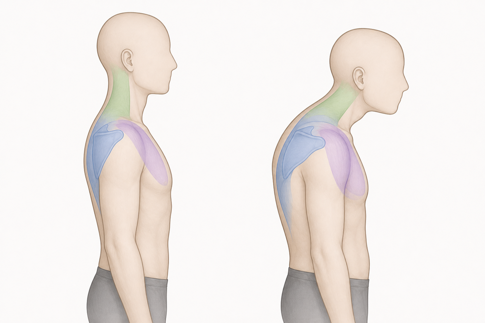

# Forward Head Posture

Author: xiongxianfei
Created: 2026-06-30
Last reviewed: 2026-06-30
Next review due: 2026-09-28
Review scope: sources, red flags, scope boundary, comprehension

## What this page is

This page explains forward head posture as an observable head, neck, upper-back, shoulder, and rib-cage pattern. It gives beginners a way to name what they notice, clear safety routing first, and connect the pattern to general exercise options that already have full exercise pages. [BMC Musculoskeletal Disorders 2024][local-forward-head-posture-upper-crossed-review]

This page is written by an engineer who reads, not a clinician. Use the cited sources for context and use a qualified professional for individual assessment.

## What this page is not

This page does not diagnose the reader, prove that a posture is harmful, or provide individualized care. It does not promise to change posture, explain all pain, or turn five exercises into a personal plan.

## Red flags: when to stop reading and seek care

Stop using this page as a self-education guide and seek appropriate care if neck, shoulder, arm, or headache symptoms feel severe, unusual, rapidly worsening, linked to trauma, linked to fever or unexplained illness, linked to weakness, numbness, tingling, balance trouble, or otherwise unsafe. NICE CKS advises urgent referral or further investigation when non-specific neck pain has red flags suggesting serious pathology. [NICE CKS][local-forward-head-posture-nice-neck-red-flags]

Read [the full red-flags reference](../RED-FLAGS.md) before using any GymPrimer page to think about pain or training decisions.

## Why beginners come to this page

Beginners usually land here because they notice one of four things:

- the head looks forward in side-view photos or videos
- the neck or upper back gets tired during desk work, rows, presses, or planks
- the shoulders look rounded forward even when standing relaxed
- a coach, trainer, or social-media video named forward head posture and they want a safer explanation

## Working definition

Forward head posture means the head appears forward relative to the torso when viewed from the side. In a simple landmark model, the ear sits forward of the shoulder line, the neck often angles forward, the upper back may look rounded, and the rib cage and shoulders may follow that shape. This is an observable position, not a medical condition.

Neutral alignment is not a perfect vertical line. People move through many head and shoulder positions during normal life and training. The useful question is whether the position, control, comfort, and exercise context matter for the reader, not whether one still photo looks ideal.

## How to notice this in yourself

These are observations, not diagnoses.

- **Side-view photo:** take a relaxed side-view photo and notice the relationship between ear, shoulder, rib cage, upper back, and pelvis.
- **Wall-stand observation:** stand comfortably near a wall and notice whether the head, upper back, and rib cage can rest without forcing the neck or ribs.
- **Training-video observation:** watch a light row, wall slide, or plank video and notice whether the head drifts forward as the set gets harder.
- **Position-change observation:** compare how the neck and upper back feel after long sitting, a warm-up, and a normal training session.

## The core reason

Forward head posture is usually discussed through a few movement contributors. Treat them as useful observations, not as a single cause.

**Daily-position load.** Long sitting, screens, reading, and repeated forward-reaching can make a forward head and rounded upper-back position feel familiar. Familiar does not mean harmful by itself; it means the position may be a useful observation when choosing exercise options. [BMC Musculoskeletal Disorders 2024][local-forward-head-posture-upper-crossed-review]

**Head-and-neck control.** The head is heavy relative to the neck, so a beginner may need practice finding small, quiet neck movements instead of only pushing the chin forward or lifting the chin. Chin-nod style drills are included as awareness options, not as a proof that the neck is broken. [BMC Musculoskeletal Disorders 2024][local-forward-head-posture-upper-crossed-review]

**Upper-back position.** A rounded upper back can make it harder to find comfortable rib-cage, shoulder, and neck positions during rows, presses, planks, and wall drills. Thoracic-extension options give the upper back another movement choice without promising a permanent posture change. [BMC Musculoskeletal Disorders 2024][local-forward-head-posture-upper-crossed-review]

**Shoulder-blade and rotator-cuff context.** AAOS describes shoulder impingement and rotator-cuff tendinitis education around restoring motion, later strengthening the rotator cuff, and addressing posture. GymPrimer uses that only as shoulder/scapular context: wall slides, prone Y/T, and band pull-aparts train shoulder-blade and upper-back options, not a shoulder care pathway. [AAOS][aaos-shoulder-impingement-rotator-cuff-tendinitis]

**General strength exposure.** For most beginners, the exercise question is not whether one special corrective menu exists. ACSM's 2026 resistance-training update emphasizes that consistency matters more for most adults than complex programming, so the options below fit best as general strength and movement choices. [ACSM][acsm-resistance-training]

## What is uncertain or mixed

A 2024 systematic review and meta-analysis found therapeutic exercise improved group measures of forward head posture, rounded shoulder, and hyperkyphosis among people with upper crossed syndrome. That supports exercise as a reasonable education topic, but it does not prove that one reader's posture must change, that pain will improve, or that forward head posture has one cause. [BMC Musculoskeletal Disorders 2024][local-forward-head-posture-upper-crossed-review]

Shoulder and neck education also needs context. Shoulder/scapular training can be useful for movement options, but GymPrimer should not copy institutional orthopedics material into a home treatment pathway. Red flags, persistent symptoms, and uncertainty belong with qualified professionals. [NICE CKS][local-forward-head-posture-nice-neck-red-flags] [AAOS][aaos-shoulder-impingement-rotator-cuff-tendinitis]

## What commonly helps

Read this as a menu of education options that a coach or clinician may select from, not as a sequence, routine, or personal prescription. The pattern journey is:

> user's pain point -> observable pattern -> likely movement contributors -> exercises that train the missing options

### 0. Reduce posture anxiety

Forward head posture is a visible pattern, not proof that the body is damaged. Start with red flags, then use the exercises below as general movement options.

### 1. Clear red flags first

If any red flag above applies, stop here and read [the red-flags reference](../RED-FLAGS.md). Exercise content is not the right next step when safety flags are present. [NICE CKS][local-forward-head-posture-nice-neck-red-flags]

### 2. Practice head, upper-back, and shoulder-blade options

- **[Chin nod](../exercises/chin-nod.md)**
  - *Fix reason:* trains small head-and-neck awareness so the reader has another option besides jutting the chin forward.
  - *Used muscles:* deep neck flexors and front-of-neck control muscles primary; light upper-back postural support secondary.
  - *Important note:* keep the movement gentle and small; use the red-flags reference if symptoms feel unsafe. [NICE CKS][local-forward-head-posture-nice-neck-red-flags]
- **[Thoracic extension](../exercises/thoracic-extension.md)**
  - *Fix reason:* gives the upper back an extension option that can make shoulder and neck positions easier to explore.
  - *Used muscles:* thoracic spinal extensors and upper-back posture muscles; trunk muscles help keep the rib cage controlled.
  - *Important note:* move through the upper back without forcing the low back or dropping the head backward.
- **[Wall slide](../exercises/wall-slide.md)**
  - *Fix reason:* practices shoulder flexion with shoulder-blade upward rotation instead of letting the head and ribs chase the movement.
  - *Used muscles:* serratus anterior and shoulder flexors primary; upper-back and rotator-cuff muscles assist position.
  - *Important note:* keep the range small enough that the shoulders do not shrug hard toward the ears.
- **[Prone Y/T](../exercises/prone-y-t.md)**
  - *Fix reason:* trains lower-trapezius and mid-back control that can support the shoulder blades during pulling and overhead work.
  - *Used muscles:* lower trapezius and middle trapezius primary; rear deltoids, rotator cuff, and trunk support secondary.
  - *Important note:* lift only a few inches and keep the neck quiet instead of turning the drill into a low-back arch.
- **[Band pull-apart](../exercises/band-pull-apart.md)**
  - *Fix reason:* gives beginners a simple horizontal-pulling option for upper-back strength and shoulder-blade control.
  - *Used muscles:* middle trapezius, rear deltoids, and rhomboids primary; rotator cuff and trunk muscles assist position.
  - *Important note:* use a light band and keep the shoulders away from the ears.

### 3. Broader collected exercise list

These are secondary examples to consider later, not detailed complete-loop options in this slice: seated row, lat pulldown, chest-supported row, cable face pull, band external rotation, scapular retraction drill, doorway pec stretch, open-book thoracic rotation, plank, dead bug, bird dog, and farmer carry.

### 4. Train consistently, not specially

The options above should connect back to ordinary beginner training: a pull, a push, a squat or hinge pattern, trunk control, low-intensity cardio, and enough recovery to repeat practice. See [Beginner Training Principles](../principles/beginner-training-principles.md) and [How Many Days a Week Should I Train?](../principles/how-many-days-a-week.md) for the broader frame. [ACSM][acsm-resistance-training]

## What to avoid

Avoid posture-shaming, guaranteed posture promises, and language that treats a side-view photo as proof that something is wrong. Avoid forcing a rigid chin-tucked position during every lift; the goal is movement options and control, not one correct posture. Avoid copying generic posture menus when pain, nerve symptoms, medical history, or major movement limits change the situation. Avoid turning the five exercise links above into a daily checklist without a reason.

## When to see a professional

See a physical therapist when symptoms persist, normal activity is limited, training repeatedly flares symptoms, or the question is return to activity after an injury. A physical therapist can assess movement, symptoms, and exercise tolerance in person.

See a GP or other medical clinician when symptoms come with the red flags above, symptoms are not improving, neurological signs appear, or non-training health concerns are present. NICE CKS red-flag guidance is the reason this page routes safety before exercise options. [NICE CKS][local-forward-head-posture-nice-neck-red-flags]

Use a qualified strength coach for technique, exercise selection, and performance questions when there is no pain, medical context, or symptom uncertainty. A coach can help with rows, presses, planks, bracing, and load selection, but a coach should not assess medical symptoms.

## Where to next in this primer

- [Chin nod](../exercises/chin-nod.md) for the head-and-neck awareness side of the menu.
- [Thoracic extension](../exercises/thoracic-extension.md) for the upper-back movement side of the menu.
- [Wall slide](../exercises/wall-slide.md) for shoulder-blade control during overhead reach.
- [Band pull-apart](../exercises/band-pull-apart.md) for a simple upper-back strength option.
- [Beginner Training Principles](../principles/beginner-training-principles.md) for the broader training frame.

## Sources

- [NICE CKS - Neck pain: non-specific management][local-forward-head-posture-nice-neck-red-flags]
- [BMC Musculoskeletal Disorders 2024 - Exercise effects on forward head posture, rounded shoulder, and hyperkyphosis][local-forward-head-posture-upper-crossed-review]
- [AAOS - Shoulder impingement and rotator cuff tendinitis][aaos-shoulder-impingement-rotator-cuff-tendinitis]
- [ACSM - Resistance training guidance update 2026][acsm-resistance-training]

[local-forward-head-posture-nice-neck-red-flags]: https://cks.nice.org.uk/topics/neck-pain-non-specific/management/management/
[local-forward-head-posture-upper-crossed-review]: https://pmc.ncbi.nlm.nih.gov/articles/PMC10832142/
[aaos-shoulder-impingement-rotator-cuff-tendinitis]: https://orthoinfo.aaos.org/en/diseases--conditions/shoulder-impingementrotator-cuff-tendinitis/
[acsm-resistance-training]: https://acsm.org/resistance-training-guidelines-update-2026/

## Author and review date

xiongxianfei, engineer who reads, not a clinician, 2026-06-30
